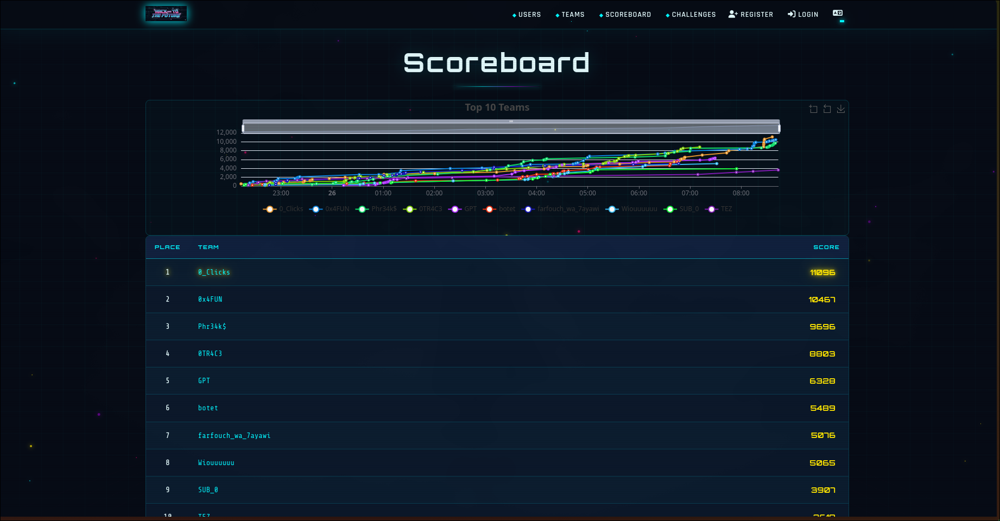

🚀 Proud to Announce Our `3rd Place` Finish at `Hack To The Future CTF 2.0`!

I’m proud to share that my team `Phr34k$` and I secured **3rd place** at `Hack To The Future CTF 2.0`, organized by `Securinets EPS` at `Ecole Polytechnique de Sousse`. 🥉

This CTF was a great experience filled with **technical challenges**, **teamwork**, and intense problem-solving under pressure. Throughout the competition, I had the opportunity to work on several categories, including **Crypto**, **Pwn**, **Reverse Engineering**, and **Forensics**. 💻

The challenges were not easy, but we kept pushing, sharing ideas, adapting as a team, and staying focused until the end. 🔥

🤝 Huge respect to all the participating teams for their effort and skills.

🙌 Special thanks to the organizing team for creating such an exciting and valuable cybersecurity event.

This experience pushed me further in my cybersecurity journey and made me even more motivated for the next challenge. 🚀

