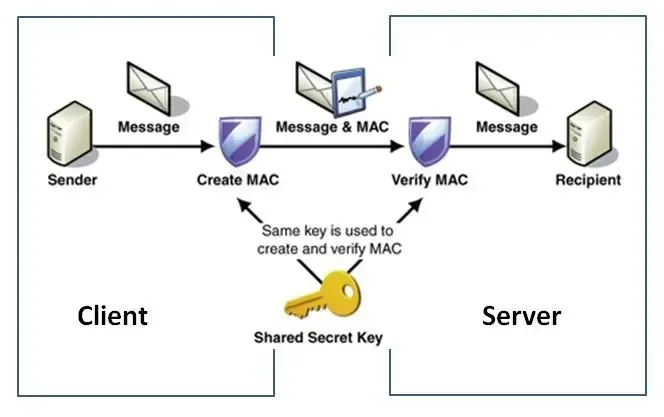
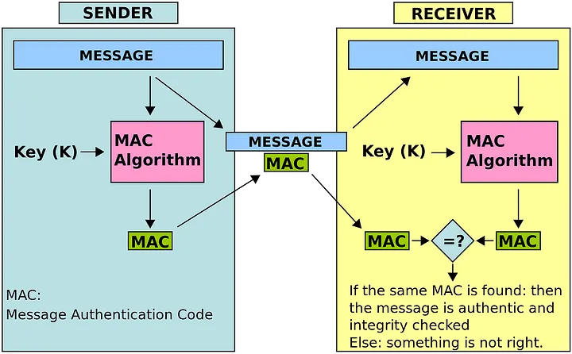
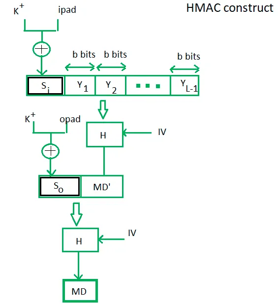
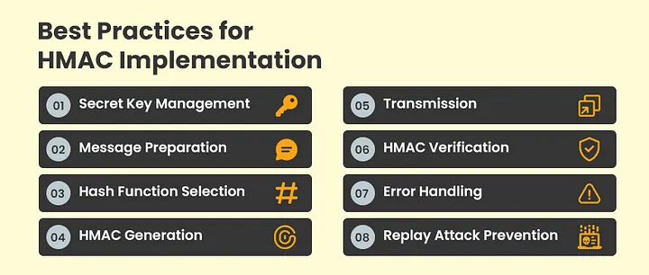

## Introduction
In today’s interconnected digital landscape, ensuring that a message has not been tampered with during transmission is just as important as keeping its contents confidential. One of the most effective tools for verifying message integrity and authenticity is `HMAC` **(Hash-based Message Authentication Code)**. In this blog post, we’ll explore what HMAC is, why it matters, and how you can integrate it into your C applications using practical code examples.




---

## What Is HMAC?

HMAC is a mechanism for message authentication that uses cryptographic hash functions (such as SHA-256) along with a secret key. It produces a fixed-size output (the MAC) that is unique to both the message and the key. This signature helps recipients verify that the message hasn’t been altered and confirms the sender’s identity.


> **Key aspects of HMAC include:**
- `Message Integrity:` Even a small change in the message results in a drastically different HMAC.
- `Authentication:` Only someone with the secret key can generate or verify the correct HMAC.
- `Flexibility:` It can work with various cryptographic hash functions, offering a balance between performance and security.



---


## Integrating HMAC in C
To integrate HMAC into your C programs, you can use the OpenSSL library, which provides robust cryptographic functions. Below is a simple example demonstrating how to compute an HMAC using the SHA-256 hash function.

> ***HMAC in C: Code Example***
```C
#include <stdio.h>
#include <string.h>
#include <openssl/hmac.h>
#include <openssl/evp.h>

int main() {
    // Define a secret key and a message
    const char *key = "supersecretkey";
    const char *message = "This is a test message for HMAC";

    // Buffer for the HMAC digest
    unsigned char digest[EVP_MAX_MD_SIZE];
    unsigned int digest_len = 0;

    // Compute the HMAC using SHA-256
    HMAC(EVP_sha256(), key, strlen(key), (unsigned char*)message, strlen(message), digest, &digest_len);

    // Print the resulting HMAC in hexadecimal format
    printf("HMAC (SHA-256): ");
    for (unsigned int i = 0; i < digest_len; i++) {
        printf("%02x", digest[i]);
    }
    printf("\n");

    return 0;
}
```
### Explanation of the Code:
- `Key & Message:` The secret key and the message are defined as strings.
- `Digest Buffer:` A buffer is allocated to hold the **HMAC** result. **EVP_MAX_MD_SIZE** is used to ensure the buffer is large enough for any supported hash function.
- `HMAC Calculation:` The **HMAC( )**function from OpenSSL computes the HMAC using the SHA-256 hash algorithm. The result is stored in **digest**, and its length is updated in digest_len.
- `Output:` The resulting **HMAC** is printed in a hexadecimal format.



---
## How HMAC Enhances Message Integrity
HMAC ensures that:
1. `Integrity Check:` The recipient computes the **HMAC** over the received message using the same secret key. A mismatch indicates tampering.
2. `Authentication:` Only someone with the secret key can produce a valid **HMAC**, thereby authenticating the sender.

> These properties make HMAC invaluable in secure communications, file transfers, and API request validations.


---
## Best Practices for Using HMAC
- `Secure Key Management:` Always protect and manage your secret keys securely.
- `Use Strong Hash Functions:` SHA-256 or higher is recommended over older algorithms like MD5.
- `Combine with Encryption:` While HMAC verifies integrity, combining it with encryption ensures both confidentiality and integrity.
- `Validate on Both Ends:` Always verify the HMAC on the receiving end to detect any data corruption or tampering.



---
## Final Thoughts
Integrating **HMAC** for message integrity is a powerful addition to your security toolkit. It not only confirms that the message hasn’t been altered during transit but also authenticates its origin. By leveraging libraries like OpenSSL in your C applications, you can implement HMAC quickly and effectively, bolstering the security of your communications.

Would you like to explore more advanced implementations, such as combining HMAC with encryption or error handling improvements in C? **Feel free to reach out for further discussion!**
