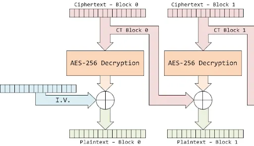
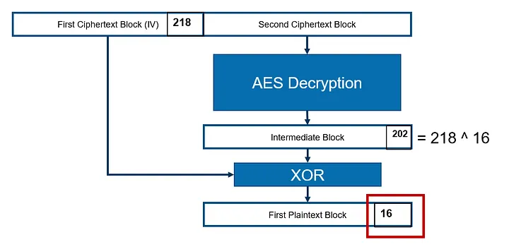

## Introduction
When it comes to protecting sensitive data, encryption plays a crucial role in modern security systems. One of the most popular modes of **AES (Advanced Encryption Standard)** is the **CBC (Cipher Block Chaining)** mode. In this blog, we’ll explore how CBC works, why it’s essential, and how to implement it using C with practical code examples.


---
## What Is AES CBC Mode?
AES in `Cipher Block Chaining (CBC)` mode encrypts blocks of data by chaining them together. Each block of plaintext is XORed with the previous ciphertext block before being encrypted.

This process ensures that identical plaintext blocks produce different ciphertext blocks, enhancing security.


> Key Elements of CBC Mode:

- `Initialization Vector (IV):` A random block used for the first encryption step.

- `Chaining:` Each encrypted block depends on the previous ciphertext block.


---

## Why Use CBC Mode?
CBC mode offers several advantages:
- `Increased Security:` Reduces the risk of pattern detection.
- `Integrity Protection:` Chaining ensures even small changes in plaintext affect multiple ciphertext blocks.

However, it requires the same IV and key for decryption, which adds complexity to key management.


---
## AES Encryption in CBC Mode
> (C Code Example)


Here’s a simple implementation using OpenSSL’s AES functions:
```C
#include <stdio.h>
#include <string.h>
#include <openssl/aes.h>
#include <openssl/rand.h>

void encryptAES_CBC(const unsigned char *plaintext, unsigned char *ciphertext, const unsigned char *key, unsigned char *iv) {
    AES_KEY encryptKey;
    AES_set_encrypt_key(key, 128, &encryptKey);
    
    AES_cbc_encrypt(plaintext, ciphertext, strlen((const char *)plaintext), &encryptKey, iv, AES_ENCRYPT);
}

int main() {
    unsigned char key[16] = "mysecurekey12345";  
    unsigned char iv[AES_BLOCK_SIZE];
    unsigned char plaintext[32] = "SensitiveDataForEncryption";
    unsigned char ciphertext[32];

    // Generate a random IV
    if (!RAND_bytes(iv, AES_BLOCK_SIZE)) {
        printf("Error generating random IV\n");
        return 1;
    }

    encryptAES_CBC(plaintext, ciphertext, key, iv);

    printf("Encrypted Ciphertext: ");
    for (int i = 0; i < sizeof(ciphertext); i++) {
        printf("%02x ", ciphertext[i]);
    }
    printf("\n");

    return 0;
}
```
---
## How CBC Mode Works
1. `Initialization Vector (IV):` Used to XOR the first block of plaintext.
2. `Encryption:` Each block of plaintext is XORed with the previous ciphertext block before encryption.
3. `Chaining:` The output of each encrypted block feeds into the next block’s encryption step.
---
## AES Decryption in CBC Mode
> (C Code Example)



Here’s how to decrypt data encrypted in CBC mode:
```C
void decryptAES_CBC(const unsigned char *ciphertext, unsigned char *decryptedText, const unsigned char *key, unsigned char *iv) {
    AES_KEY decryptKey;
    AES_set_decrypt_key(key, 128, &decryptKey);

    AES_cbc_encrypt(ciphertext, decryptedText, strlen((const char *)ciphertext), &decryptKey, iv, AES_DECRYPT);
}

int main() {
    unsigned char key[16] = "mysecurekey12345";  
    unsigned char iv[AES_BLOCK_SIZE] = {0x00};  // Ensure the IV is the same as used in encryption
    unsigned char ciphertext[32] = {0x00};      // Provide actual encrypted data here
    unsigned char decryptedText[32];

    decryptAES_CBC(ciphertext, decryptedText, key, iv);

    printf("Decrypted Text: %s\n", decryptedText);

    return 0;
}
```
> ***REMARK:***

In OpenSSL, there is **no separate function AES_cbc_decrypt( ) — AES_cbc_encrypt( )** serves both encryption and decryption depending on the flag passed **(AES_ENCRYPT or AES_DECRYPT)**. The function name might seem misleading, but it's intentional.

To clarify, this line in the code:
```C
AES_cbc_encrypt(ciphertext, decryptedText, strlen((const char *)ciphertext), &decryptKey, iv, AES_DECRYPT);
```
## Key Points
- `AES_cbc_encrypt()` handles both encryption and decryption.
- The flag `AES_DECRYPT` triggers decryption.
- The IV must match exactly what was used during encryption.
---
## Applications of AES CBC Mode
AES CBC mode is widely used in:
- `Secure Communications:` Encrypted VPN connections and TLS protocols
- `File and Disk Encryption:` Protecting data at rest
- `Cryptographic Libraries:` Implementing secure messaging systems
- `Payment Systems:` Securing financial transactions


---
## Limitations of CBC Mode
Despite its popularity, CBC mode has some limitations:
- `IV Management:` Using the same IV repeatedly weakens security.
- `Padding Vulnerabilities:` Poor padding schemes can introduce security flaws.
- `Sequential Processing:` Blocks must be processed in sequence, reducing parallelism.
---
## Best Practices for Secure AES CBC Implementation
1. `Use Secure IVs:` Always generate random IVs using secure methods like **RAND_bytes( )**.
2. `Protect Keys:` Store and manage encryption keys securely.
3. `Use Padding Properly:` Ensure correct padding schemes to avoid decryption errors.




---
## Final Thoughts
AES in CBC mode is a powerful and versatile encryption method. By understanding its inner workings and implementing it securely, you can build robust systems to protect sensitive data.
