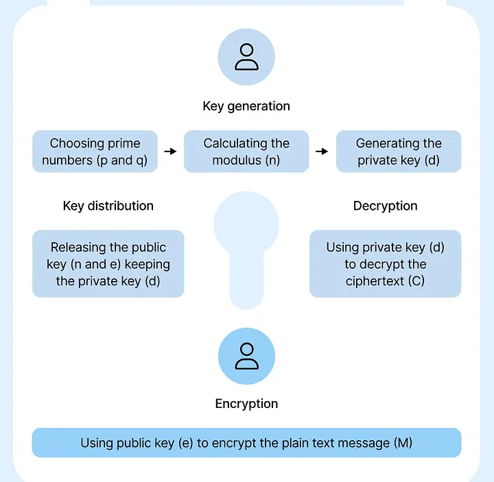
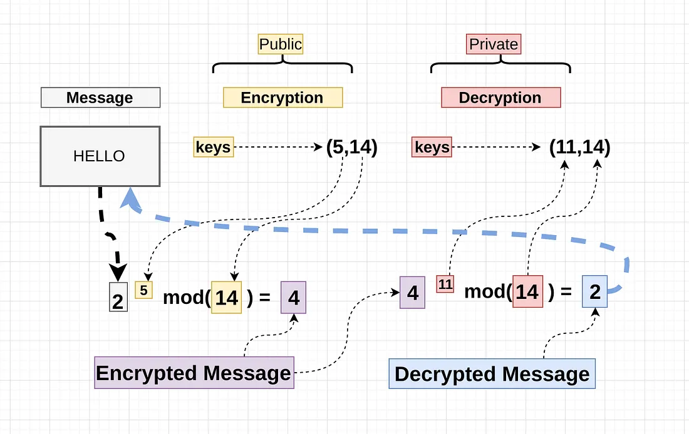
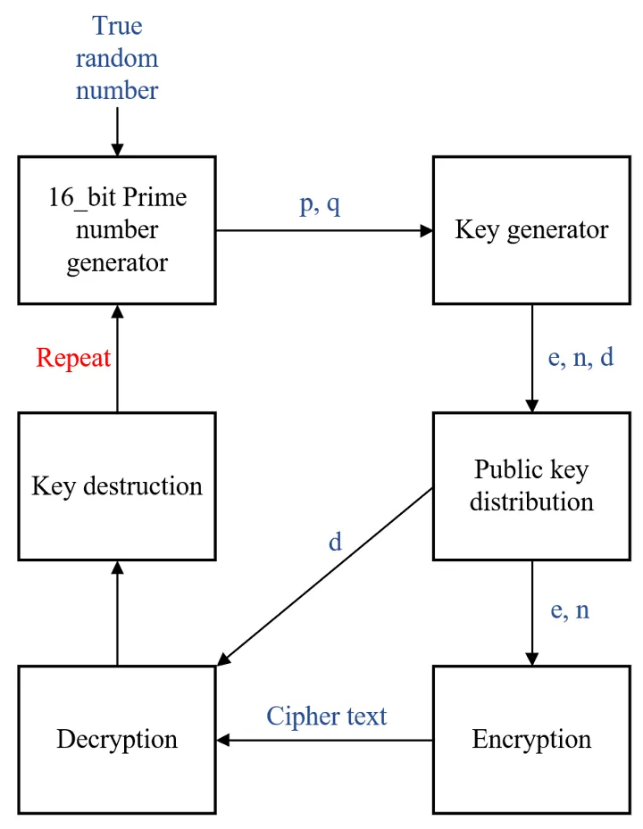
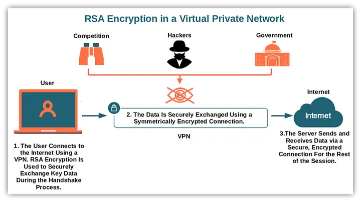

## Introduction

In today’s digital world, protecting sensitive data is more important than ever. One of the most popular methods for secure communication is `RSA encryption`, a public-key cryptosystem that allows secure data exchange without sharing a secret key beforehand. In this blog, we’ll break down how RSA works in an easy-to-understand way and demonstrate its use in C with practical code examples.


---

## What Is RSA Encryption?
RSA encryption is based on a pair of keys — a `public key`and a `private key`:
- `Public Key:` Used to encrypt messages. It can be freely shared.
- `Private Key:` Used to decrypt messages. It must be kept secret.

The beauty of **RSA** lies in its `asymmetric nature`: anyone can encrypt a message using the public key, but only the holder of the private key can decrypt it. This makes RSA ideal for scenarios where secure key exchange is challenging.


---

## How Does RSA Work?
RSA relies on mathematical properties of large prime numbers:
1. `Key Generation:` Two large prime numbers are chosen and multiplied together to create a modulus. The public and private keys are derived from this modulus and another number called the public exponent.

2. `Encryption:` The sender uses the recipient’s public key to encrypt the message, transforming it into an unreadable format.

3. `Decryption:` The recipient uses their private key to convert the ciphertext back into the original message.

This process ensures that even if someone intercepts the encrypted data, they cannot decipher it without the private key.

---

## Understanding the Mathematics Behind RSA Key Generation
RSA encryption is built upon fundamental principles of number theory. Here’s a simplified look at the math that underpins RSA:



### Key Generation
Two large prime numbers, `p` and `q`, are chosen and multiplied together to form the modulus:
> **n=p×q**
The totient of n is calculated as:
> **ϕ(n)=(p−1)×(q−1)**

### Public and Private Keys
The public key is made up of `(n, e)`, where e is a public exponent (often chosen as `65537` for efficiency and security). The private key is a number `d` that satisfies the following equation:
> **e×d≡1 mod ϕ(n)**

In other words, `d` is the modular inverse of `e modulo ϕ(n)`.

### The Challenge of Deriving the Private Key
To calculate `d`, one must know `ϕ(n)`, which in turn requires knowing the prime factors `p` and `q` of `n`. For sufficiently large primes, factoring `n` into `p` and `q` is computationally infeasible with current technology. This is why, despite knowing `n` and `e` (the public key), **it is practically impossible** to derive `d` (the private key) without breaking the underlying hard problem of integer factorization.

### Extended Euclidean Algorithm
In theory, if you could factor `n` and determine `ϕ(n)`, you would use the Extended Euclidean Algorithm to compute `d` as the modular inverse of `e modulo ϕ(n)`:
> **d=e^{−1}mod×ϕ(n)**



---

## Why You Can’t Derive the Private Key from the Public Key
In RSA, the public key is made up of a large number and an exponent, while the private key is mathematically linked to these values. However, obtaining the private key from the public key requires figuring out two secret prime numbers that were used to generate the large number. This process, known as factoring, is extremely difficult and practically impossible with current technology. As a result, even though the public key is shared openly, the private key remains secure.

---

## Implementing RSA Encryption in C

Below is a practical example demonstrating how to generate RSA keys in memory, encrypt a message using the public key, and then decrypt it using the private key. We use OpenSSL libraries to simplify cryptographic operations.

> **RSA Encryption & Decryption Code Example**

```C
#include <stdio.h>
#include <stdlib.h>
#include <string.h>
#include <openssl/rsa.h>
#include <openssl/pem.h>
#include <openssl/err.h>

int main() {
    int ret = 0;
    RSA *rsa = NULL;
    BIGNUM *bn = NULL;
    unsigned char *encrypted = NULL;
    unsigned char *decrypted = NULL;
    int encrypted_length, decrypted_length;

    // Step 1: Generate RSA Keys
    bn = BN_new();
    BN_set_word(bn, RSA_F4); // RSA_F4 == 0x10001
    rsa = RSA_new();
    if (RSA_generate_key_ex(rsa, 2048, bn, NULL) != 1) {
        ERR_print_errors_fp(stderr);
        return 1;
    }

    // Step 2: Define the message to encrypt
    unsigned char message[] = "Hello RSA Encryption!";
    int message_len = strlen((char *)message) + 1; // include null terminator

    // Allocate memory for encrypted and decrypted data
    int rsa_size = RSA_size(rsa);
    encrypted = malloc(rsa_size);
    decrypted = malloc(rsa_size);

    // Step 3: Encrypt the message using the public key
    encrypted_length = RSA_public_encrypt(message_len, message, encrypted, rsa, RSA_PKCS1_OAEP_PADDING);
    if(encrypted_length == -1) {
         ERR_print_errors_fp(stderr);
         return 1;
    }

    printf("Encrypted message (in hex):\n");
    for (int i = 0; i < encrypted_length; i++) {
         printf("%02x", encrypted[i]);
    }
    printf("\n\n");

    // Step 4: Decrypt the message using the private key
    decrypted_length = RSA_private_decrypt(encrypted_length, encrypted, decrypted, rsa, RSA_PKCS1_OAEP_PADDING);
    if(decrypted_length == -1) {
         ERR_print_errors_fp(stderr);
         return 1;
    }

    printf("Decrypted message: %s\n", decrypted);

    // Cleanup: Free allocated resources
    RSA_free(rsa);
    BN_free(bn);
    free(encrypted);
    free(decrypted);

    return 0;
}
```
> **Explanation of the Code:**
- `Key Generation:`
We generate a 2048-bit RSA key pair using **RSA_generate_key_ex()**. A BIGNUM (bn) is used to set the public exponent, commonly set to **RSA_F4**.

- `Encryption:`
The **RSA_public_encrypt()** function encrypts the plaintext message using the public key. We use **RSA_PKCS1_OAEP_PADDING** to ensure robust security through proper padding.

- `Decryption:`
The **RSA_private_decrypt()** function decrypts the ciphertext back into plaintext using the private key and the same padding scheme.

- `Output:`
The encrypted message is displayed in hexadecimal format, and the decrypted message is printed as a string.



---

## Applications of RSA Encryption
RSA encryption is widely used in:
- `Secure Communications:` Establishing secure connections over the Internet (e.g., SSL/TLS).
- `Digital Signatures:` Verifying the authenticity and integrity of digital messages.
- `Key Exchange:` Securely exchanging keys for symmetric encryption algorithms.

Its role in ensuring that data remains confidential and authentic makes RSA an essential tool in modern cybersecurity.



---

## Final Thoughts
RSA encryption simplifies secure communication by eliminating the need to share private keys. With its robust mathematical foundation, RSA continues to be a cornerstone in protecting sensitive data. By leveraging libraries like OpenSSL, you can integrate RSA encryption into your C applications with ease.
