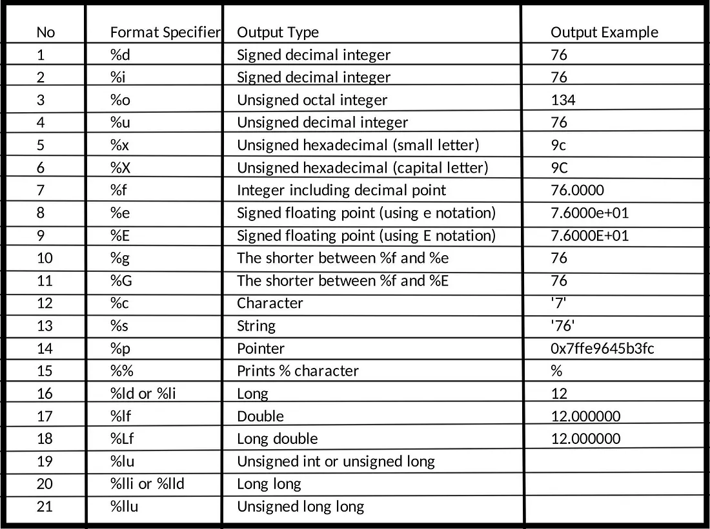

## Introduction
- In C programming, format specifiers are used to inform the compiler about the type of data to be printed or read during input and output operations. These specifiers always begin with a `%` symbol and are used in functions like `printf()`, `scanf()`, and `sprintf()`.

- Each format specifier corresponds to a specific data type, such as `%d` for integers and `%c` for characters. This guide will cover some of the most commonly used format specifiers and their practical applications.

## List of Format Specifiers
The below table contains the most commonly used format specifiers in C



---

## Examples of Format Specifiers
#### Character Format Specifier

The %c is the format specifier for the **char** data type in C language. It can be used for both formatted input and formatted output in C language.

> *Syntax:*

```C
scanf("%c...", ...);
printf("%c...", ...);
```
> *Example:*

```C
// C Program to illustrate the %c format specifier.
#include <stdio.h>

int main()
{

    char c;
    // using %c for character input
    scanf("Enter some character: %c", &c);

    // using %c for character output
    printf("The entered character: %c", &c);
    return 0;
}
```
> *Input:*

```example
Enter some character: A
```
> *Output:*
```example
The entered character: A
```
---
#### Integer Format Specifier (signed)
We can use the signed integer format specifier **%d** in the scanf() and print() functions or other functions that use formatted string for input and output of **int** data type.

> *Syntax:*
```C
scanf("%d...", ...);
printf("%i...", ...);
```
> *Example:*
```C
// C Program to demonstrate the use of %d and %i
#include <stdio.h>

// Driver code
int main()
{
    int x;
    // taking integer input
    scanf("Enter the two integers: %d", &x);

    // printing integer output
    printf("Printed using %%d: %d\n", x);
    printf("Printed using %%i: %3i\n", x);
    return 0;
}
```
> *Input:*

```example
Enter the integer: 21
```
> *Output:*
```example
Printed using %d: 21
Printed using %i:    21
```
---
#### Unsigned Integer Format Specifier
The **%u** is the format specifier for the unsigned integer data type. If we specify a negative integer value to the **%u**, it converts the integer to its 2’s complement.

> *Syntax:*
```C
printf("%u...", ...);
scanf("%u...", ...);
```
> *Example:*
```C
// C Program to illustrate the how to use %u
#include <stdio.h>


int main()
{
    unsigned int var;

    scanf("Enter an integer: %u", &var);

    printf("Entered Unsigned Integer: %u", var);

    // trying to print negative value using %u
    printf("Printing -10 using %%u: %u\n", -10);
    return 0;
}
```
> *Input:*

```example
Enter an integer: 25
```
> *Output:*
```example
Entered unsigned integer: 25
Printing -10 using %u: 4294967286
```
---
#### Floating-point format specifier
The **%f** is the floating point format specifier in C language that can be used inside the formatted string for input and output of **float** data type. Apart from **%f**, we can use **%e** or **%E** format specifiers to print the **floating point value in the exponential form.**

> *Syntax:*
```C
printf("%f...", ...);
scanf("%e...", ...);
printf("%E...", ...);
```
> *Example:*
```C
// C program to demonstrate the use of %f, %e  and %E
#include <stdio.h>

// driver code
int main()
{
    float a = 12.67;
    printf("Using %%f: %f\n", a);
    printf("Using %%e: %e\n", a);
    printf("Using %%E, %E", a);
    return 0;
}
```
> *Output:*
```example
Using %f: 12.670000
Using %e: 1.267000e+01
Using %E, 1.267000E+01
```
---
#### Unsigned Octal number for integer
We can use the **%o** format specifier in the C program to print or take input for the unsigned octal integer number.

> *Syntax:*
```C
printf("%o...", ...);
scanf("%o...", ...);
```
> *Example:*
```C
#include <stdio.h>
int main()
{
    int a = 67;
    printf("%o\n", a);
    return 0;
}
```
> *Output:*
```example
103
```
---
#### Unsigned Hexadecimal for integer
The **%x** format specifier is used in the formatted string for hexadecimal integers. In this case, the alphabets in the hexadecimal numbers will be in lowercase. For uppercase alphabet digits, we use **%X** instead.

> *Syntax:*
```C
printf("%x...", ...);
scanf("%X...", ...);
```
> *Example:*
```C
// C Program to demonstrate the use of %x and %X
#include <stdio.h>
int main()
{
    int a = 15454;
    printf("%x\n", a);
    printf("%X", a);
    return 0;
}
```
> *Output:*
```example
3c5e
3C5E
```
---
#### String Format Specifier
The **%s** in C is used to print strings or take strings as input.

> *Syntax:*
```C
printf("%s...", ...);
scanf("%s...", ...);
```
> *Example:*
```C
// C program to illustrate the use of %s in C
#include <stdio.h>

int main()
{
    char a[] = "Hi Guys";
    printf("%s\n", a);
    return 0;
}
```
> *Output:*
```example
Hi Guys
```
* ***Example:*** The working of **%s** with scanf() is a little bit different from its working with printf(). Let’s understand this with the help of the following C program.
```C
// C Program to illustrate the working of %s with scanf()
#include <stdio.h>

int main()
{

    char str[50];
    // taking string as input
    scanf("Enter the String: %s", str);

    printf("Entered String: %s", str);

    return 0;
}
```
> *Input:*
```example
Enter the string: Hi Guys
```
> *Output:*
```example
Hi
```

As we can see, the string is only scanned till a whitespace is encountered. We can avoid that by using [scansets](/blog/programming/scansets-in-c/) in C.

---
#### Address Format Specifier
The C language also provides the format specifier to print the address/pointers. We can use **%p** to print addresses and pointers in C

> *Syntax:*
```C
printf("%p...", ...);
```
> *Example:*
```C
#include <stdio.h>
int main()
{
    int a = 10;
    printf("The Memory Address of a: %p\n",(void*)&a);
    return 0;
}
```
> *Output:*
```example
The Memory Address of a: 0x7ffe9645b3fc
```
---
## Input and Output Formatting
C language provides some tools using which we can format the input and output. They are generally inserted between the % sign and the format specifier symbol Some of them are as follows:
1. A minus(-) sign tells left alignment.
2. A number after % specifies the minimum field width to be printed if the characters are less than the size of the width the remaining space is filled with space and if it is greater then it is printed as it is without truncation.
3. A period( . ) symbol separates field width with precision.
Precision tells the minimum number of digits in an integer, the maximum number of characters in a string, and the number of digits after the decimal part in a floating value.

## Example of I/O Formatting
```C
// C Program to demonstrate the formatting methods.
#include <stdio.h>
int main()
{
    char str[] = "unlimitedcodes";
    printf("%20s\n", str);
    printf("%-20s\n", str);
    printf("%20.5s\n", str);
    printf("%-20.5s\n", str);
    return 0;
}
```
> *Output:*
```example
      unlimitedcodes
unlimitedcodes      
               unlim
unlim      
```
---
## Common Questions
- `Does C have a format specifier for binary numbers?`

    - No, the C language does not provide a format specifier for binary numbers.
- `What is the formatted string?`
    - The input and output functions in C take a string as an argument that decides how the data is displayed on the screen or the data is retrieved to the memory. This string is called the formatted string.
