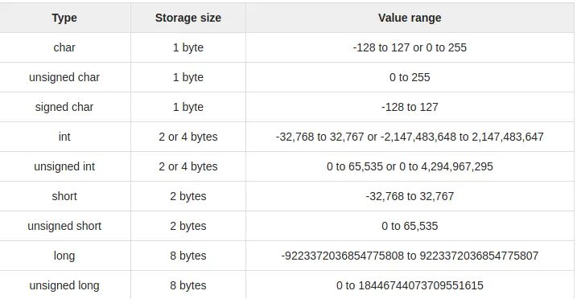

## Introduction
**char** is the most basic data type in C. It stores a single character and requires a **single byte of memory** in almost all compilers.



---

Now character datatype can be divided into 2 types:

1. **signed char**

2. **unsigned char**


## unsigned char
- **unsigned char** is a character datatype where the variable consumes all the 8 bits of the memory and there is no sign bit (which is there in signed char). So it means that the range of unsigned char data type ranges **from 0 to 255.**

> *Syntax:*

```C
unsigned char [variable_name] = [value]
```

> *Example:*

```C
unsigned char ch = 'a';
```
---
## Initializing an unsigned char
- **Initializing an unsigned char:** Here we try to insert a char in the unsigned char variable with the help of ASCII value. So the ASCII value 97 will be converted to a character value, i.e. ‘a’ and it will be inserted in unsigned char.

```C
// C program to show unsigned char 

#include <stdio.h> 

int main() 
{ 

 int chr = 97; 
 unsigned char i = chr; 
 printf("unsigned char: %c\n", i); 

 return 0; 
}
```

> *Output:*

```C
unsigned char: a
```
- **Initializing an unsigned char with signed value:** Here we try to insert a char in the unsigned char variable with the help of ASCII value. So the ASCII value -1 will be first converted to a range 0–255 by rounding. So it will be 255. Now, this value will be converted to a character value, i.e. ‘ÿ’ and it will be inserted in unsigned char.

```C
// C program to show unsigned char 

#include <stdio.h> 

int main() 
{ 

 int chr = -1; 
 unsigned char i = chr; 
 printf("unsigned char: %c\n", i); 

 return 0; 
}
```

> *Output:*

```C
unsigned char: ÿ
```
