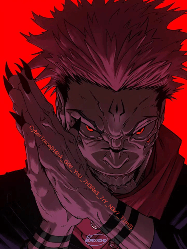

**Challenge Name:** TOP SECRET  
**Category:** Cryptography  
**CTF:** CyberSummit V4.0 CTF  
**Description:** SUKUNA is On a secret mission all along, but the only trace he left is this bon file i can't seem to get a hint of it can you help me  

---

## Initial Reconnaissance

We were given two files `out.bin` and `script.py`  
The first step was checking what files we actually had and what type of artifact `out.bin` was.

```bash
ls
file out.bin
```

Then we opened `script.py` and found the full encryption flow.

```python
import os, struct, random
from pathlib import Path
from Crypto.Cipher import AES
from Crypto.Util.Padding import pad

HIDDEN_KEY = b'\xde\xad\xbe\xef\xca\xfe\xba\xbe'
AES_KEY  = bytes.fromhex('0123456789abcdef0123456789abcdef0123456789abcdef0123456789abcdef')
AES_IV   = bytes.fromhex('cafebabe0000000000000000deadbeef')
BLOCK_SIZE = 64
RANDOM = 1337
X_SEED = 42
X = 1024

def xor_bytes(data, key):
    return bytes(b ^ key[i % len(key)] for i, b in enumerate(data))

def shuffle_blocks(data, seed, block_size):
    blocks = [data[i:i+block_size] for i in range(0, len(data), block_size)]
    r = random.Random(seed)
    r.shuffle(blocks)
    return b''.join(blocks), [blocks.index(b) for b in [data[i:i+block_size] for i in range(0,len(data),block_size)]]

def inject_padding(data, size, seed):
    r = random.Random(seed)
    n = r.randint(3, 8)
    positions = sorted(r.sample(range(len(data)+1), n))
    result = bytearray()
    prev = 0
    for pos in positions:
        result += data[prev:pos]
        chunk_size = size // n
        result += bytes([r.randint(0,255) for _ in range(chunk_size)])
        prev = pos
    result += data[prev:]
    return bytes(result)

def encrypt(input_path, output_path):
    data = Path(input_path).read_bytes()
    print(f'[*] original size: {len(data)} bytes')

    data = xor_bytes(data, HIDDEN_KEY)
    cipher = AES.new(AES_KEY, AES.MODE_CBC, AES_IV)
    data = cipher.encrypt(pad(data, AES.block_size))
    data, _ = shuffle_blocks(data, RANDOM, BLOCK_SIZE)
    data = inject_padding(data, X, X_SEED)
    header = b'BANG' + struct.pack('>I', len(data))
    Path(output_path).write_bytes(header + data)
    print(f'[+] written to {output_path} ({len(header)+len(data)} bytes)')

if __name__ == '__main__':
    import sys
    encrypt(sys.argv[1], sys.argv[2])
```

Key observations from `script.py`:

1. Data is XORed with a fixed key (`HIDDEN_KEY`).
2. Then encrypted with AES-CBC (fixed key + fixed IV).
3. Then shuffled in deterministic 64-byte blocks (seed = 1337).
4. Then random junk is injected using deterministic RNG (seed = 42, total size = 1024).
5. Final file is wrapped with a custom header: `BANG` + big-endian length.

So this was not brute force crypto. It was deterministic obfuscation that can be reversed exactly.

---

## Thinking Process

The challenge looked noisy because of layers, but every layer was reversible:

1. `BANG` header gives us exact payload boundary.
2. Padding junk is deterministic because RNG seed and algorithm are known.
3. Shuffle is deterministic because seed is known.
4. AES key/IV are hardcoded in the script.
5. XOR key is also hardcoded.

That means the solver should just replay the exact inverse pipeline in reverse order:

```text
parse header -> strip junk -> unshuffle -> AES decrypt -> XOR -> recovered image
```

---

## How We Wrote The Solver

We built the solver in practical stages:

**1) Parse and validate the custom container**

We check magic bytes `BANG` and read the 4-byte payload length. This avoids accidental trailing-byte mistakes.

**2) Remove injected junk first**

Because junk was added after all crypto transforms, we remove it first.

For the default mode (`random_junk`):

1. Recreate RNG with seed 42.
2. Recompute number of insertion points `n` and chunk size `size // n`.
3. Rebuild original insertion positions.
4. Copy real segments and skip junk chunks.

**3) Reverse the block shuffle**

We regenerate the same shuffled index permutation with seed 1337 and invert the mapping to restore original block order.

**4) AES-CBC decrypt**

Decrypt with the same key and IV from `script.py`, then unpad PKCS#7.

**5) Reverse XOR**

Apply the same repeating XOR key to get original bytes back.

**6) Validate output**

Check for image magic bytes (PNG/JPEG/BMP/GIF/WEBP) and write the recovered file.

---

## Full `solver.py`

```python
#!/usr/bin/env python3


import os
import sys
import struct
import random
import argparse
import base64
from pathlib import Path

# ──────────────────────────────────────────────
#  KEYS & CONSTANTS
# ──────────────────────────────────────────────
XOR_KEY      = b'\xde\xad\xbe\xef\xca\xfe\xba\xbe'
AES_KEY      = bytes.fromhex('0123456789abcdef0123456789abcdef'
         '0123456789abcdef0123456789abcdef')
AES_IV       = bytes.fromhex('cafebabe0000000000000000deadbeef')
RC4_KEY      = b'CTFchallenge2024'
BLOCK_SIZE   = 64
SHUFFLE_SEED = 1337
PAD_SEED     = 42
PAD_SIZE     = 1024


MAGIC = b'BANG'

# ──────────────────────────────────────────────
#  CIPHER PRIMITIVES
# ──────────────────────────────────────────────

def xor_bytes(data: bytes, key: bytes) -> bytes:
 return bytes(b ^ key[i % len(key)] for i, b in enumerate(data))


def rc4(data: bytes, key: bytes) -> bytes:
 S = list(range(256))
 j = 0
 for i in range(256):
  j = (j + S[i] + key[i % len(key)]) % 256
  S[i], S[j] = S[j], S[i]
 i = j = 0
 out = []
 for byte in data:
  i = (i + 1) % 256
  j = (j + S[i]) % 256
  S[i], S[j] = S[j], S[i]
  out.append(byte ^ S[(S[i] + S[j]) % 256])
 return bytes(out)


def aes_decrypt(data: bytes) -> bytes:
 from Crypto.Cipher import AES
 from Crypto.Util.Padding import unpad
 cipher = AES.new(AES_KEY, AES.MODE_CBC, AES_IV)
 return unpad(cipher.decrypt(data), AES.block_size)


def unshuffle_blocks(data: bytes, seed: int, block_size: int) -> bytes:
 """Reverse the deterministic block shuffle."""
 blocks = [data[i:i+block_size] for i in range(0, len(data), block_size)]
 r = random.Random(seed)
 indices = list(range(len(blocks)))
 r.shuffle(indices)
 # indices[new_pos] = orig_pos  →  result[orig_pos] = blocks[new_pos]
 result = [None] * len(blocks)
 for new_i, orig_i in enumerate(indices):
  result[orig_i] = blocks[new_i]
 return b''.join(result)


# ──────────────────────────────────────────────
#  PADDING STRIPPERS
# ──────────────────────────────────────────────

def strip_random_junk(data: bytes, size: int, seed: int) -> bytes:
 r = random.Random(seed)
 n = r.randint(3, 8)
 chunk_size = size // n

 # total padded length = original + n*chunk_size
 original_len = len(data) - n * chunk_size

 # replay RNG to get positions (sampled from original_len+1 range)
 r2 = random.Random(seed)
 r2.randint(3, 8)                            # consume the 'n' draw
 positions = sorted(r2.sample(range(original_len + 1), n))

 result = bytearray()
 src = 0     # cursor into padded data
 prev_pos = 0
 for pos in positions:
  segment_len = pos - prev_pos
  result += data[src:src + segment_len]
  src += segment_len + chunk_size         # skip injected junk
  prev_pos = pos
 result += data[src:]
 return bytes(result)


def strip_lorem(data: bytes, size: int, seed: int) -> bytes:
 chunk = size // 4
 n = 4
 original_len = len(data) - n * chunk

 r = random.Random(seed)
 positions = sorted(r.sample(range(original_len + 1), n))

 result = bytearray()
 src = 0
 prev_pos = 0
 for pos in positions:
  segment_len = pos - prev_pos
  result += data[src:src + segment_len]
  src += segment_len + chunk
  prev_pos = pos
 result += data[src:]
 return bytes(result)


def strip_file_chunks(data: bytes, size: int, seed: int) -> bytes:
 chunk = size // 8

 # estimate: padded = orig + (orig//stride)*chunk, stride = orig//8
 # padded = orig + 8*chunk  (there are exactly 8 strides)
 original_len_est = len(data) - 8 * chunk
 stride = max(1, original_len_est // 8)

 result = bytearray()
 i = 0
 while i < len(data):
  result += data[i:i + stride]
  i += stride + chunk
 return bytes(result)


def strip_null_blocks(data: bytes, size: int) -> bytes:
 result = bytearray()
 i = 0
 null_block = b'\x00' * size
 while i <= len(data) - size:
  if data[i:i + size] == null_block:
   i += size
  else:
   result.append(data[i])
   i += 1
 result += data[i:]
 return bytes(result)


# ──────────────────────────────────────────────
#  LAYER DETECTION HELPERS
# ──────────────────────────────────────────────

def looks_like_png(data: bytes) -> bool:
 return data[:8] == b'\x89PNG\r\n\x1a\n'


def looks_like_image(data: bytes) -> bool:
 """Heuristic: PNG, JPEG, BMP, GIF, WEBP magic bytes."""
 return (looks_like_png(data) or
   data[:3] == b'\xff\xd8\xff' or   # JPEG
   data[:2] == b'BM'              or   # BMP
   data[:6] in (b'GIF87a', b'GIF89a') or
   data[:4] == b'RIFF')


# ──────────────────────────────────────────────
#  MAIN SOLVER
# ──────────────────────────────────────────────

LAYER_ORDER_ENCRYPT = ['xor', 'rc4', 'b64', 'aes', 'byte_reverse', 'shuffle']

def solve(input_path: str,
    output_path: str,
    layers: list,
    pad_mode: str,
    pad_size: int = PAD_SIZE,
    pad_seed: int = PAD_SEED,
    shuffle_seed: int = SHUFFLE_SEED,
    block_size: int = BLOCK_SIZE,
    verbose: bool = True) -> bool:

 def log(msg):
  if verbose:
   print(msg)

 raw = Path(input_path).read_bytes()

 # ── parse header ──────────────────────────────
 if raw[:4] != MAGIC:
  print(f'[!] bad magic bytes: {raw[:4]!r}  (expected {MAGIC!r})')
  print('    Are you sure this file was produced by encrypt.py?')
  return False

 data_len = struct.unpack('>I', raw[4:8])[0]
 data = raw[8:8 + data_len]
 log(f'[*] header OK  — data payload: {len(data):,} bytes')

 # ── strip padding ────────────────────────────
 log(f'[*] stripping padding  (mode={pad_mode}, pad_size={pad_size})')
 try:
  if pad_mode == 'random_junk':
   data = strip_random_junk(data, pad_size, pad_seed)
  elif pad_mode == 'lorem':
   data = strip_lorem(data, pad_size, pad_seed)
  elif pad_mode == 'file_chunks':
   data = strip_file_chunks(data, pad_size, pad_seed)
  elif pad_mode == 'null_blocks':
   data = strip_null_blocks(data, pad_size)
  else:
   print(f'[!] unknown pad_mode: {pad_mode}')
   return False
  log(f'[+] after strip: {len(data):,} bytes')
 except Exception as e:
  print(f'[!] padding strip failed: {e}')
  return False

 # ── reverse encryption layers (reverse order) ─
 active = [l for l in LAYER_ORDER_ENCRYPT if l in layers]
 log(f'[*] reversing layers: {" → ".join(active)} (will apply in reverse)')

 for layer in reversed(active):
  try:
   if layer == 'shuffle':
    data = unshuffle_blocks(data, shuffle_seed, block_size)
    log('[+] block shuffle reversed')
   elif layer == 'byte_reverse':
    data = data[::-1]
    log('[+] byte reverse reversed')
   elif layer == 'aes':
    data = aes_decrypt(data)
    log('[+] AES-256-CBC decrypted')
   elif layer == 'b64':
    data = base64.b64decode(data)
    log('[+] Base64 decoded')
   elif layer == 'rc4':
    data = rc4(data, RC4_KEY)
    log('[+] RC4 decrypted')
   elif layer == 'xor':
    data = xor_bytes(data, XOR_KEY)
    log('[+] XOR reversed')
  except Exception as e:
   print(f'[!] layer "{layer}" failed: {e}')
   return False

 # ── validate result ───────────────────────────
 if looks_like_image(data):
  log(f'[✓] valid image header detected ({data[:4]!r})')
 else:
  log(f'[?] first bytes: {data[:16].hex()}  — may not be an image')
  log('    (if output looks wrong, check layer list and pad_mode)')

 Path(output_path).write_bytes(data)
 log(f'[✓] written → {output_path}  ({len(data):,} bytes)')
 return True


# ──────────────────────────────────────────────
#  CLI
# ──────────────────────────────────────────────

def main():
 parser = argparse.ArgumentParser(
  formatter_class=argparse.RawDescriptionHelpFormatter,
 )
 parser.add_argument('input',  help='encrypted .bin file')
 parser.add_argument('output', help='output image path (e.g. recovered.png)')
 parser.add_argument('--pad-mode', default='random_junk',
      choices=['random_junk', 'lorem', 'file_chunks', 'null_blocks'],
      help='padding mode used during encryption (default: random_junk)')
 parser.add_argument('--pad-size',     type=int, default=PAD_SIZE,
      help=f'padding size in bytes (default: {PAD_SIZE})')
 parser.add_argument('--pad-seed',     type=int, default=PAD_SEED,
      help=f'padding RNG seed (default: {PAD_SEED})')
 parser.add_argument('--shuffle-seed', type=int, default=SHUFFLE_SEED,
      help=f'block shuffle seed (default: {SHUFFLE_SEED})')
 parser.add_argument('--block-size',   type=int, default=BLOCK_SIZE,
      help=f'shuffle block size (default: {BLOCK_SIZE})')
 parser.add_argument('--xor',          action='store_true', help='XOR layer active')
 parser.add_argument('--aes',          action='store_true', help='AES-256-CBC layer active')
 parser.add_argument('--rc4',          action='store_true', help='RC4 layer active')
 parser.add_argument('--b64',          action='store_true', help='Base64 layer active')
 parser.add_argument('--byte-reverse', action='store_true', help='byte reverse layer active')
 parser.add_argument('--shuffle',      action='store_true', help='block shuffle layer active')
 parser.add_argument('-q', '--quiet',  action='store_true', help='suppress output')

 args = parser.parse_args()

 layer_flags = {
  'xor': args.xor, 'aes': args.aes, 'rc4': args.rc4,
  'b64': args.b64, 'byte_reverse': args.byte_reverse, 'shuffle': args.shuffle
 }
 layers = [k for k, v in layer_flags.items() if v]
 if not layers:
  print('[*] no layers specified — using default (xor + aes + shuffle)')
  layers = ['xor', 'aes', 'shuffle']

 ok = solve(
  input_path=args.input,
  output_path=args.output,
  layers=layers,
  pad_mode=args.pad_mode,
  pad_size=args.pad_size,
  pad_seed=args.pad_seed,
  shuffle_seed=args.shuffle_seed,
  block_size=args.block_size,
  verbose=not args.quiet
 )
 sys.exit(0 if ok else 1)


if __name__ == '__main__':
 main()
```

---

## Final Execution

```bash
python3 solver.py out.bin recover.png
```

Observed output flow:

```text
[*] no layers specified — using default (xor + aes + shuffle)
[*] header OK  — data payload: 248,064 bytes
[*] stripping padding  (mode=random_junk, pad_size=1024)
[+] after strip: 247,040 bytes
[*] reversing layers: xor → aes → shuffle (will apply in reverse)
[+] block shuffle reversed
[+] AES-256-CBC decrypted
[+] XOR reversed
[✓] valid image header detected (b'\x89PNG')
[✓] written → recover.png  (247,026 bytes)
```

---

## Final Flag



```text
CyberTrace{H4hA_G0t!_YoU_7H3Re$_7rY_N3x7_T1m3}
```

---

## Key Notes

1. This challenge is fully breakable through deterministic state replay.
2. Hardcoded keys + fixed IV + known seeds remove uncertainty.
3. The only real work is reversing operation order correctly.
4. Parsing container/padding correctly is more important than raw crypto difficulty.
