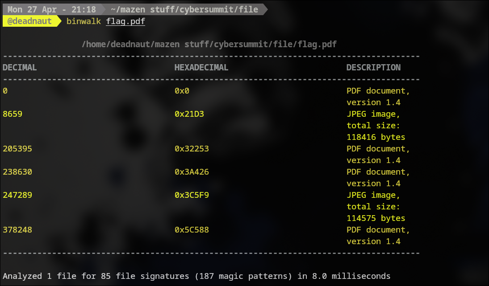
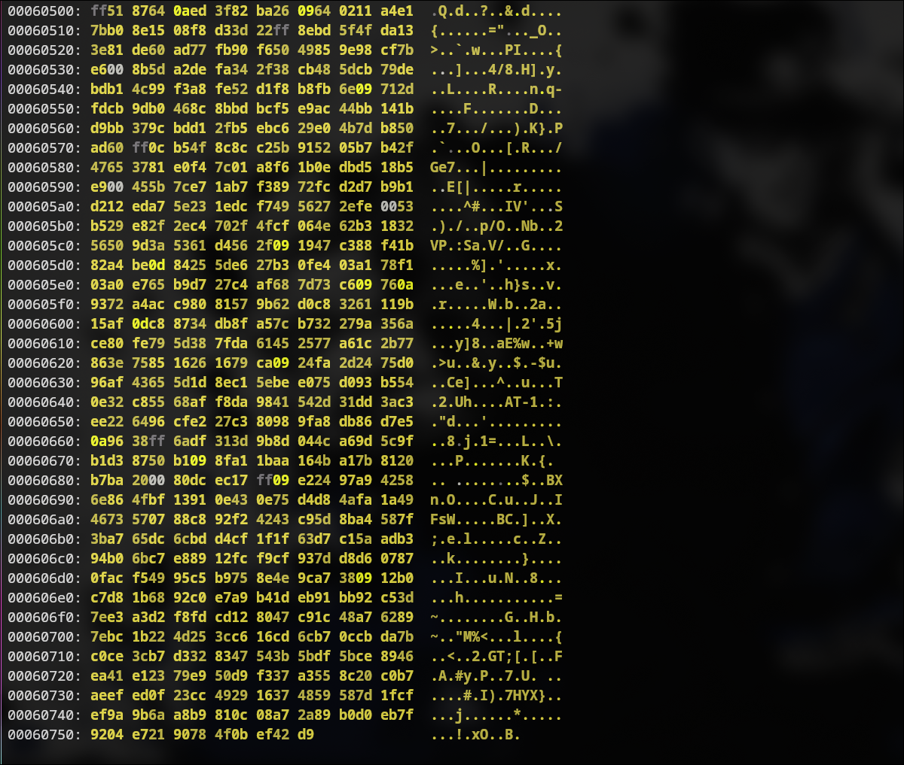
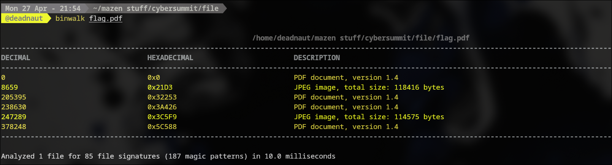
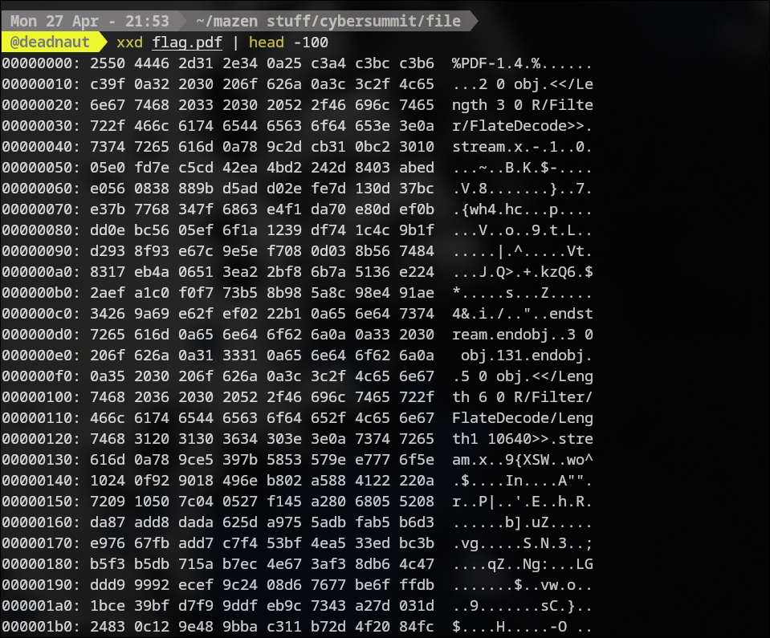
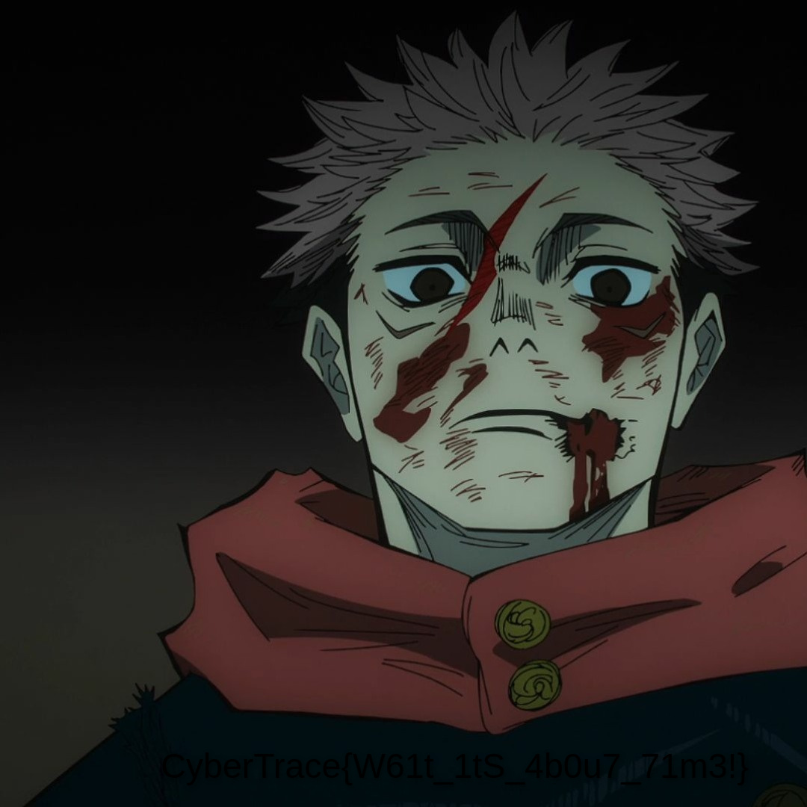

**Challenge Name:** Gift Card  
**Category:** Forensics  
**CTF:** CyberSummit V4.0 CTF  
**Description:** I feel generous today here is a free flag

---

## Initial Analysis

The challenge file was `flag.pdf`, but it was not a normal PDF. Running `binwalk` immediately showed that it contained multiple embedded file signatures, including JPEG and PDF data.



That told me this was a layered file-carving challenge, not a simple stego problem.

The important observation was that the real image data was split across the carrier and one of the fragments was reversed at the byte level.



The visible image content also suggested that the flag was hidden in the lower half of the final reconstructed picture.


---

## What We Got

The carrier was intentionally built so that:

1. The first part of the image is stored directly in the file.
2. A PDF block is placed between the two image fragments.
3. The second image fragment is written in reverse byte order.

The intended workflow was therefore:

1. Use `binwalk` and `xxd` to identify the embedded structures.
2. Use `dd` to carve out the two real image fragments.
3. Reverse the second fragment.
4. Concatenate the pieces to rebuild the original JPEG.

---

## How It Was Solved

### 1. Inspect the carrier

The first step was to confirm that the file contained embedded data rather than a single PDF. `binwalk` showed the main PDF header at offset `0`, then the first image fragment, then more embedded content.



`xxd` was useful for checking the file boundaries and confirming that the file started as a normal PDF but contained binary payloads after the header.



### 2. Extract the first image half

The first image fragment begins right after the initial PDF block. In this challenge build, that offset was `8659` bytes.

I extracted the first half with `dd`:

```bash
dd if=flag.pdf of=part1.bin bs=1 skip=8659 count=94038 status=none
```

### 3. Extract the reversed second half

The second image half starts after the inserted PDF block between the fragments. The offset used here was:

```text
8659 + 94038 + 8659 = 111356
```

I extracted the reversed half with `dd`:

```bash
dd if=flag.pdf of=part2.rev bs=1 skip=111356 count=94039 status=none
```

### 4. Reverse the second half

Because the second fragment was stored backward, I reversed it back to normal byte order using `xxd`:

```bash
xxd -p -c1 part2.rev | tac | xxd -r -p > part2.bin
```

### 5. Rebuild the image

Finally, I concatenated the two recovered fragments:

```bash
cat part1.bin part2.bin > solve.jpg
```

Opening `solve.jpg` showed the original image, with the flag written across the bottom.



---

## Final Flag

`CyberTrace{W61t_1tS_4b0u7_i71m3!}`
