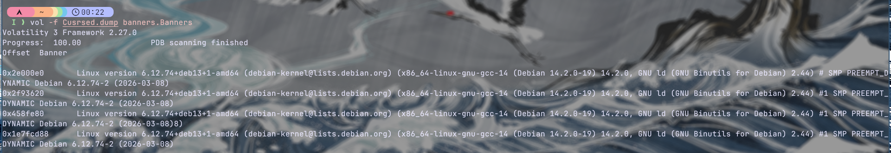
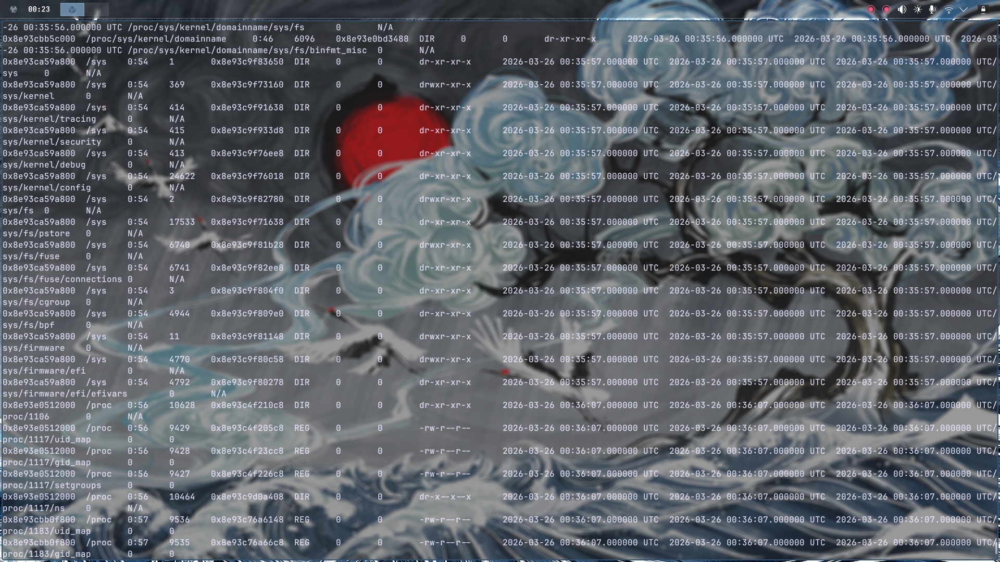
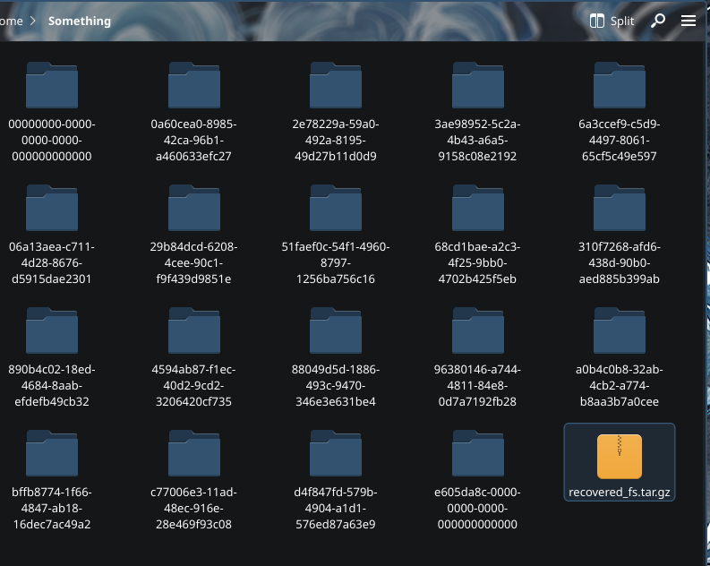
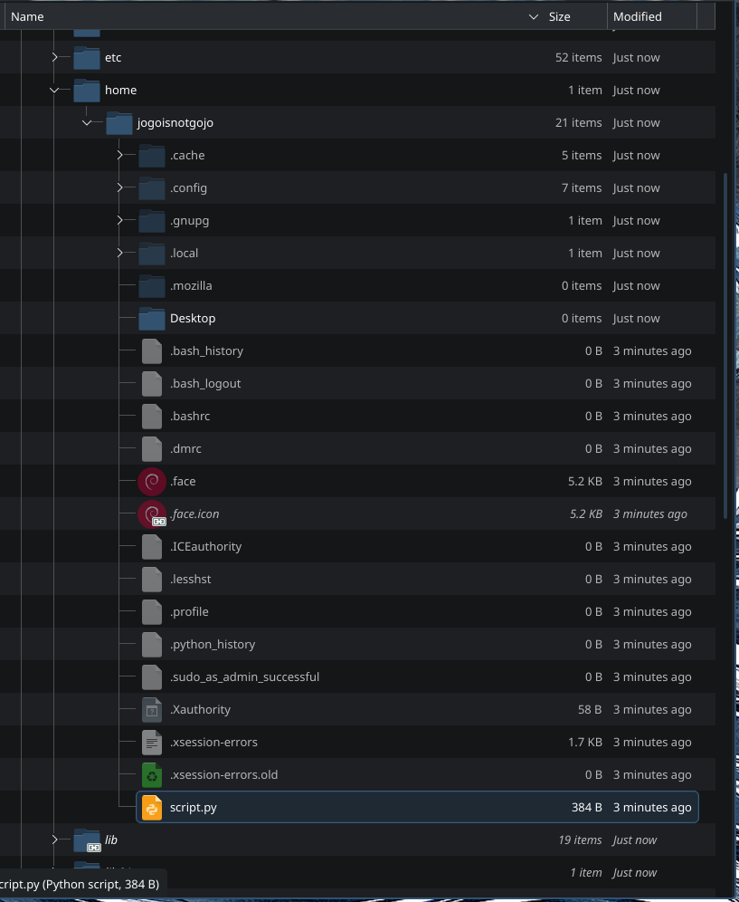
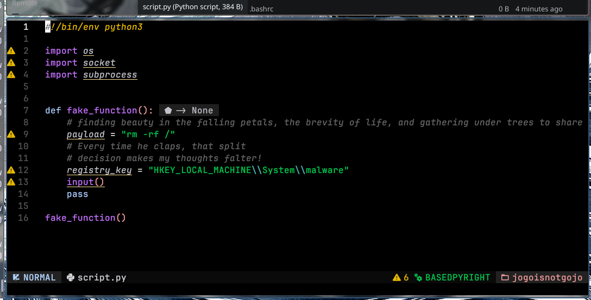
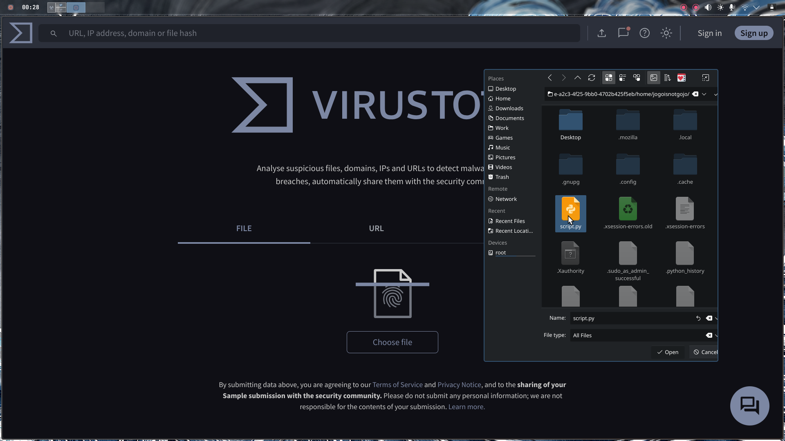
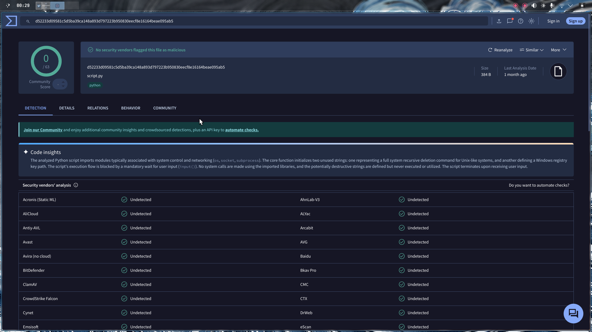
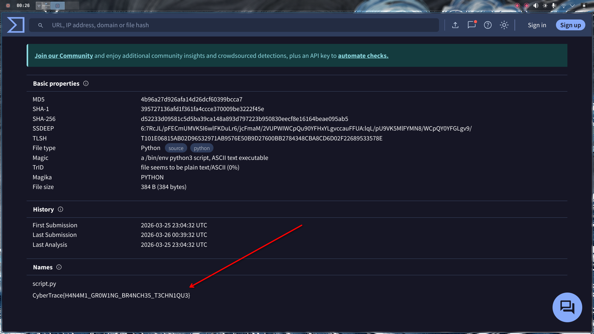

**Challenge Name:** Panic Attack I  
**Category:** Forensics  
**CTF:** CyberSummit V4.0 CTF  
**Description:** "A cursed spirit has infiltrated Jujutsu High's systems — no barrier can stop it." The sorcerers of Jujutsu High have detected an anomaly. Their main workstation has been struck by a Cursed Malware — a technique so vile it leaves traces even the strongest Reverse Cursed Technique cannot erase. Hidden within the infected system lies a suspicious file, whispering secrets in a language only the worthy can unveil it.  

Can you channel your inner sorcerer, hunt down the cursed artifact, and uncover what it's hiding before the Culling Game begins?  

Here'is the challenge file for Panic Attack I: [Panic Attack](https://drive.google.com/file/d/1AqMsJnVnglr6EoLRggvxwV-j6euMjCew/view)

---

## The Challenge

We're given a memory dump called `Cursed.dump` and a vague but intriguing description: *"A cursed spirit has infiltrated Jujutsu High's systems... Hidden within the infected system lies a suspicious file, whispering secrets in a language only the worthy can unveil it."* Basically, there's malware in the system and we need to find it and extract the secrets it's hiding.

---

## Initial Reconnaissance: What's in the Dump?

The challenge gives us a memory dump, which immediately screams **Volatility**. Before diving deep, I needed to figure out what OS we're dealing with. A quick banner check tells us everything:

```bash
volatility -f Cursed.dump banners.Banners
```



It's a Linux memory dump, specifically from Debian. This is crucial because it determines which Volatility plugins we'll use and what filesystem structure to expect.

---

## Extracting the Filesystem: Finding the Needle in the Haystack

Volatility has a fantastic feature to dump the entire filesystem from a memory image. I extracted everything into a zip package:




After extracting, I got a ton of folders. Rather than wandering aimlessly, I sorted by size to identify the biggest directory — which typically contains the full Linux root filesystem. Bingo.



**when overwhelmed with data, prioritize by size**. The attacker's artifacts are usually in the most populated directories.

---

## The Hunt: `script.py` Stands Out

I navigated to the `home` directory expecting to find user files, configs, maybe some bash history. What I found was... interesting. Among the normal stuff, there was a file that immediately caught my attention: **`script.py`**.



---

## The Smoking Gun: Fake Registry Key

I examined `script.py` and found something odd. It contained what looked like a fake function with a hardcoded registry key:

```
HKEY_LOCAL_MACHINE\System\malware
```

Wait. Registry keys? That's Windows-specific syntax, but we found this in a Linux memory dump. This is a **red flag**—literally encoded into the malware as a breadcrumb. The challenge description mentioned `Cursed Malware`, and this registry key reference is exactly the kind of obfuscated hint that challenges love to hide.



This file is clearly our target. Time to investigate it further.

---

## Leveraging Threat Intelligence: VirusTotal

At this point, I had the malware file, but the flag wasn't inside it. The challenge hinted that I need to "unveil" what it's hiding. So I uploaded `script.py` to [**VirusTotal**](https://www.virustotal.com) — the ultimate threat intelligence database.



Here's where it gets interesting: the file was scanned approximately **one month ago**. That's recent. It's not some ancient malware from 2015—this is active, recent threat activity.



---

## Final Flag

I navigated to the **Details** tab on VirusTotal, and there it was—buried in the threat intelligence data, the flag was sitting right there:



**Flag:**  

```text
CyberTrace{H4N4M1_GR0W1NG_BR4NCH35_T3CHN1QU3}
```

---

## Key Takeaways

1. **Memory forensics requires methodical exploration** — Start with basics (banner, OS identification) before diving into deep analysis.
2. **Context matters** — A Windows registry key in Linux malware is a deliberate hint that something is wrong with that file.
3. **Threat intelligence is your friend** — Sometimes the flag isn't in the malware itself, but in the metadata that external services have already collected.
4. **Challenges reward lateral thinking** — The solution wasn't buried deep in hex dumps or memory sections; it was in a public threat intelligence database.
