**Challenge Name:** Panic Attack II  
**Category:** Forensics  
**CTF:** CyberSummit V4.0 CTF  
**Description:** "The curse runs deeper than we thought." Exorcising the malware was only the beginning. The curse user left more than just a file — they left a identity. Hidden within the system is a sorcerer who doesn't belong, a phantom user lurking in the shadows of Jujutsu High's registry.

Track down the user bearing the mark UID 1000. Uncover their name, trace the origins of their arch nemesis to their home country, and seek out the secret word — a technique known only to the most elite sorcerers who have walked the path before you.

Assemble the truth and claim your flag: CyberTrace{UserName_Country_SecretWord}

Here'is the challenge file for Panic Attack II: [Panic Attack](https://drive.google.com/file/d/1AqMsJnVnglr6EoLRggvxwV-j6euMjCew/view)

---

## Prerequisites

This challenge builds directly on [**Panic Attack I**](). You'll need the memory dump extracted from the previous challenge. If you haven't solved Panic Attack I yet, check that writeup first to understand how to extract the filesystem using Volatility. The same file is shared across both challenges, so you don't need to redownload it.

---

## Challenge Overview

"The curse runs deeper than we thought." After exorcising the malware in Panic Attack I, we discovered the attacker left behind more than just malicious files—they left an identity. A phantom user exists in the system with UID 1000, and we need to unmask them.

**Our mission:** Find three pieces of information:

1. The name of the user with UID 1000
2. The country associated with this user
3. A secret word known only to elite sorcerers

Then assemble them into the flag: `CyberTrace{UserName_Country_SecretWord}`

---

## Solution Breakdown

### Part 1: Username Hunting - Finding UID 1000

**The Hunt:** Every Linux system has a `/etc/passwd` file that stores user accounts and their metadata. This is the first place any attacker would set up a backdoor user, so it's the perfect place to start looking.

**What we did:**

1. From the Panic Attack I memory dump, we had already extracted the filesystem using Volatility
2. Navigated to the `/etc/passwd` file from the extracted dump
3. Opened the file and searched for `UID 1000`

The file format looks like this:

```
username:x:UID:GID:Full Name:Home Directory:Shell
```

When we found the entry with `UID 1000`, we discovered: **`jogoisnotgojo`**

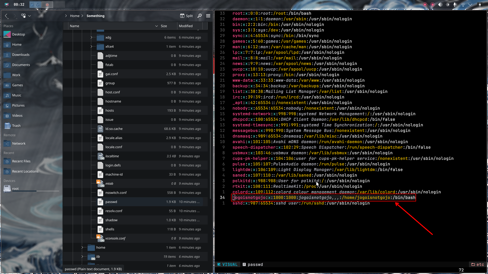

**Username:** `jogoisnotgojo`

---

### Part 2: Geolocation - Following the Money (and IPs)

**The Hunt:** Now that we have the username, we need to find where this attacker is from. Web servers often store sensitive configuration data, and `/var/www` is where web files live.

**What we did:**

1. Investigated the `/var/www` directory from our extracted memory dump
2. Found several PHP files—these are suspicious because they might contain hardcoded secrets
3. Examined the PHP code and found three base64-encoded variables:
   - `ip_b64`
   - `shell_b64`
   - `site`

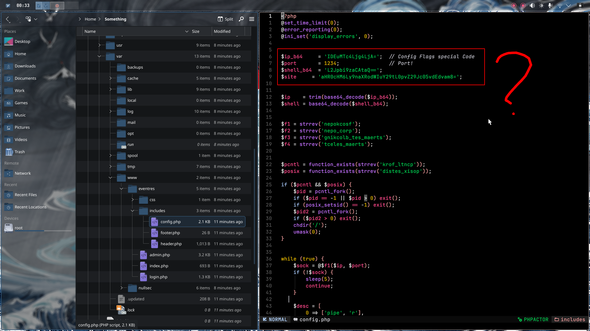

**Decrypting the base64:**  
We simply decoded each variable:  

> ip_b64:  


> shell_b64:  

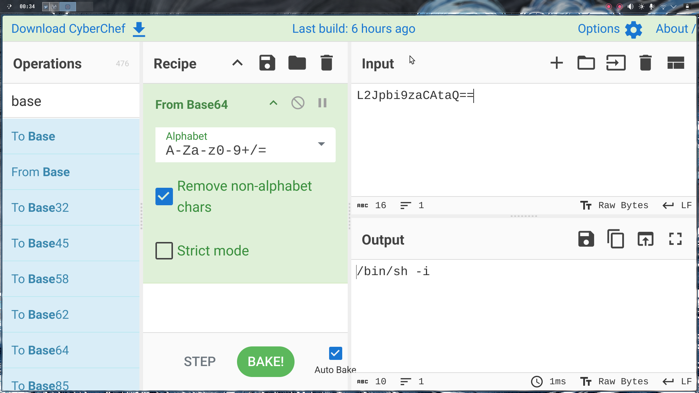

> site:  


**Finding the country:**
Once we had the IP address, we threw it into a geolocation tool like [whatismyipaddress.com](https://www.whatismyipaddress.com) or [IP2Geolocation](https://ip2geolocation.com). The lookup revealed the IP belongs to **India**.

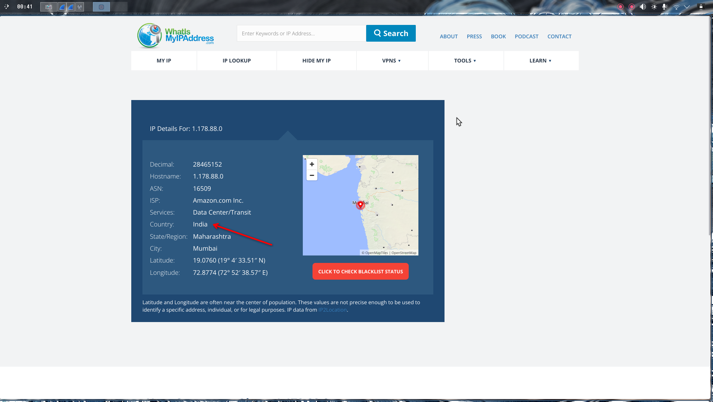

**Country:** `india`

---

### Part 3: The Secret Word - Following the Breadcrumbs

**The Hunt:** The PHP file contained a GitHub link. In CTF challenges, GitHub repos often contain hidden files, research data, or network captures. This is a classic OSINT rabbit hole, and we need to follow it.

**What we did:**

**Step 1 - GitHub Investigation:**

1. Took the decrypted GitHub link from the `site` variable
2. Navigated to the attacker's GitHub profile  

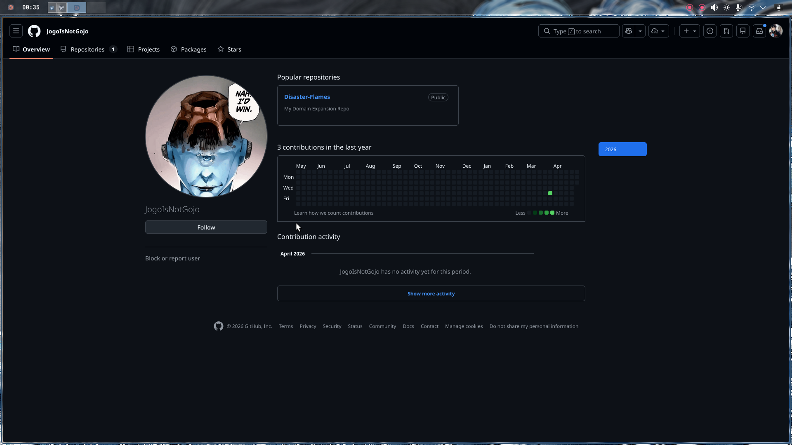

1. Found a suspicious repository named **`Disaster Flames`**
2. Explored the repo and found a file: `secret.pcapng`

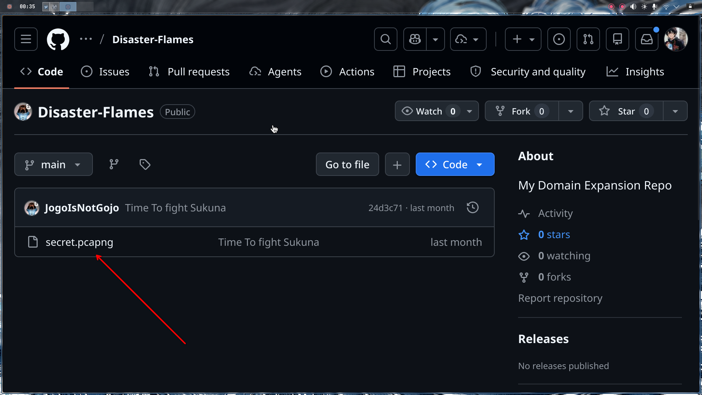

**Step 2 - PCAP Analysis in Wireshark:**

Now we have a network capture file. This is where attackers often hide data in plain sight—network traffic.

1. Downloaded `secret.pcapng` from the GitHub repo
2. Opened it in Wireshark  

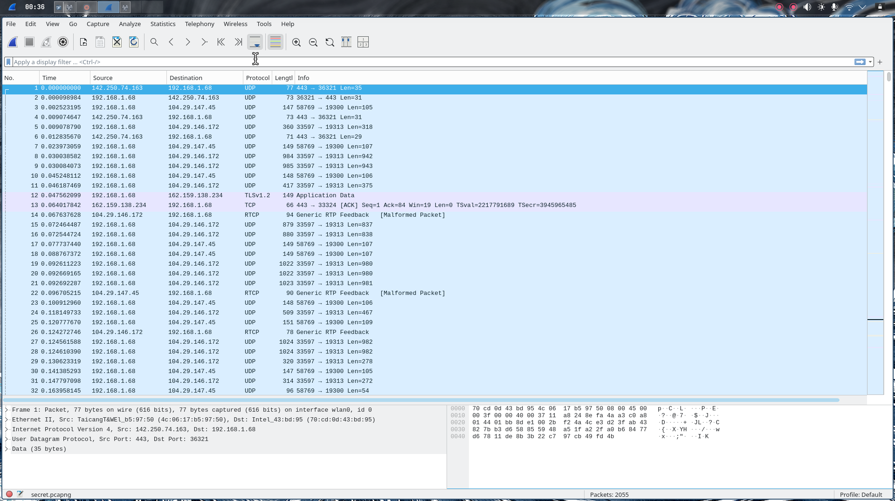
3. **Applied a filter for HTTP traffic** - this is key because the secret was likely transmitted over the web

The good news? There were only **2 HTTP packets**—this made it easy to spot.

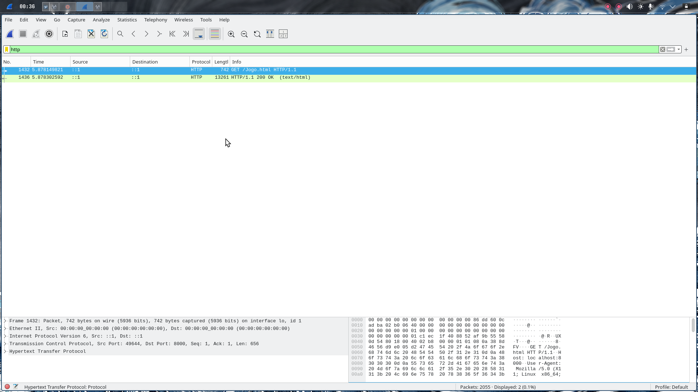

**Step 3 - Following the HTTP Stream:**

1. Right-clicked on one of the HTTP packets
2. Selected **"Follow → HTTP Stream"**
3. Wireshark reassembled the HTTP request/response

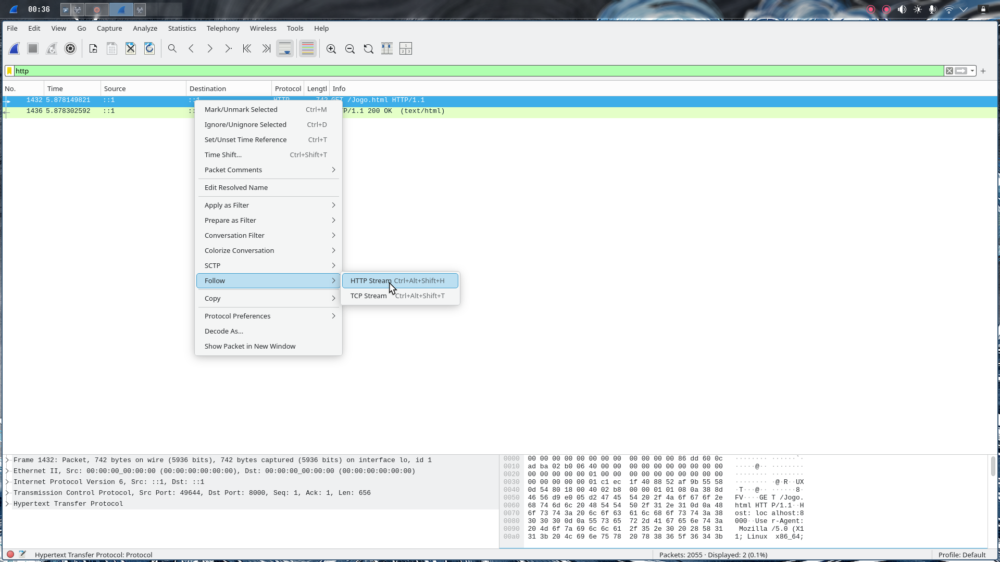

In the HTTP response, we found raw HTML content. This wasn't just random HTML—it contained something important.

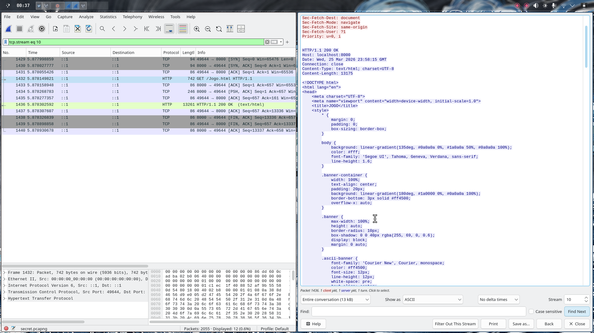

**Step 4 - Extracting the HTML:**

1. Copied the entire HTML content from the stream
2. Created a new `.html` file and pasted the content
3. Opened it in a web browser

When we rendered the HTML, we saw a banner that said: **`URE_STRONG`**

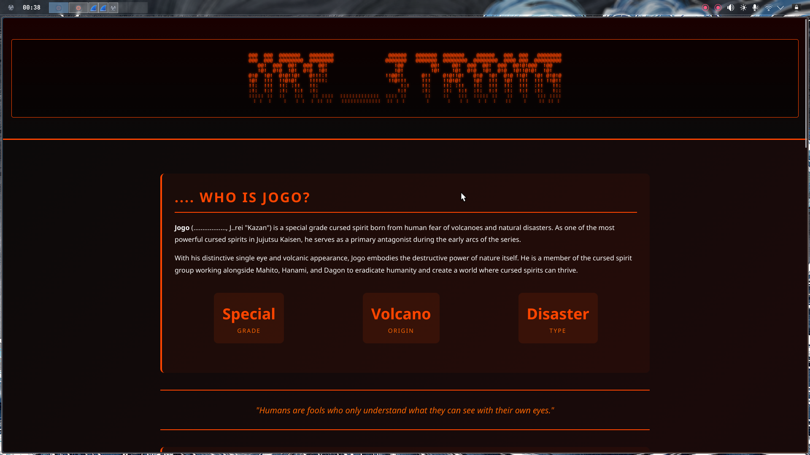

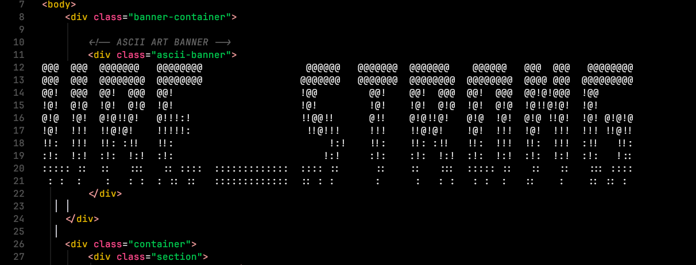

**Secret Word:** `URE_STRONG`

---

## Final Flag

Now all is left is to assemble the pieces into the final flag format:

```
CyberTrace{jogoisnotgojo_india_URE_STRONG}
```
