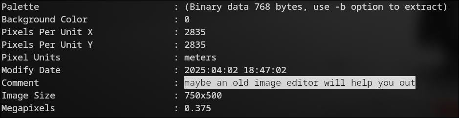
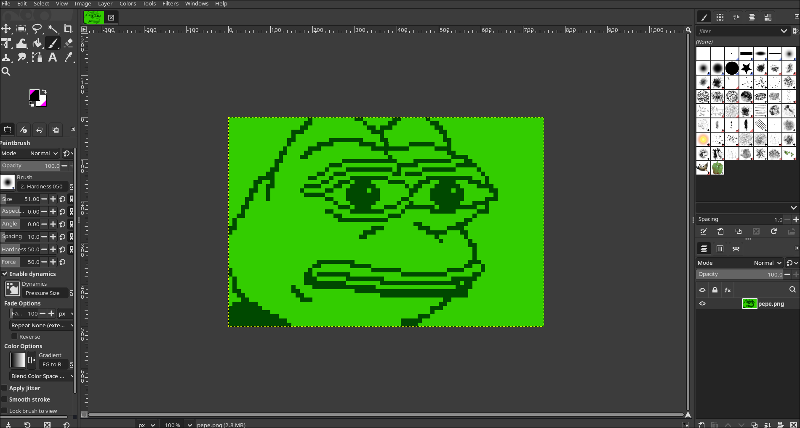
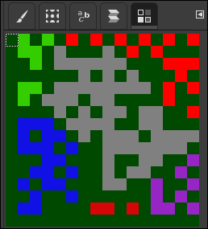

**Challenge Name:** PEPE  
**Category:** Misc  
**CTF:** CyberSummit V4.0 CTF  
**Description:** PEPE is sad all he can think is the color GREEN. whatever you will figure everything out when you see what i have created anw hope you love my art  

---

## Initial Analysis

The challenge gives us a picture of Pepe.  


At first glance, nothing looks suspicious in the image itself, so the first good step is to inspect its `metadata`. There, we find a hint that says: **"maybe an old image editor will help you out"**.

That clue points us toward an editor like GIMP, which can reveal information that a normal image viewer might not show.



## Open the Image in GIMP

We open the image in GIMP and check every available panel. Nothing unusual appears in the main image, but the interesting part is the colormap.



## Inspect the Colormap

Inside the colormap, we notice a strange pattern. It first looks like a QR code, but after looking closer, it is actually formatted like a Data Matrix code.

This means the challenge is hiding data inside the color table rather than in the visible image.



## Extract the Hidden Code

We take a screenshot of the colormap, convert it to black and white, and scan it with a Data Matrix reader.


The scan reveals a URL.


## Follow the URL

Searching the URL leads us to the final flag.


## Final Flag

```text
CyberTrace{wh0_w0uld_h@ve_guessed_4hat}
```
