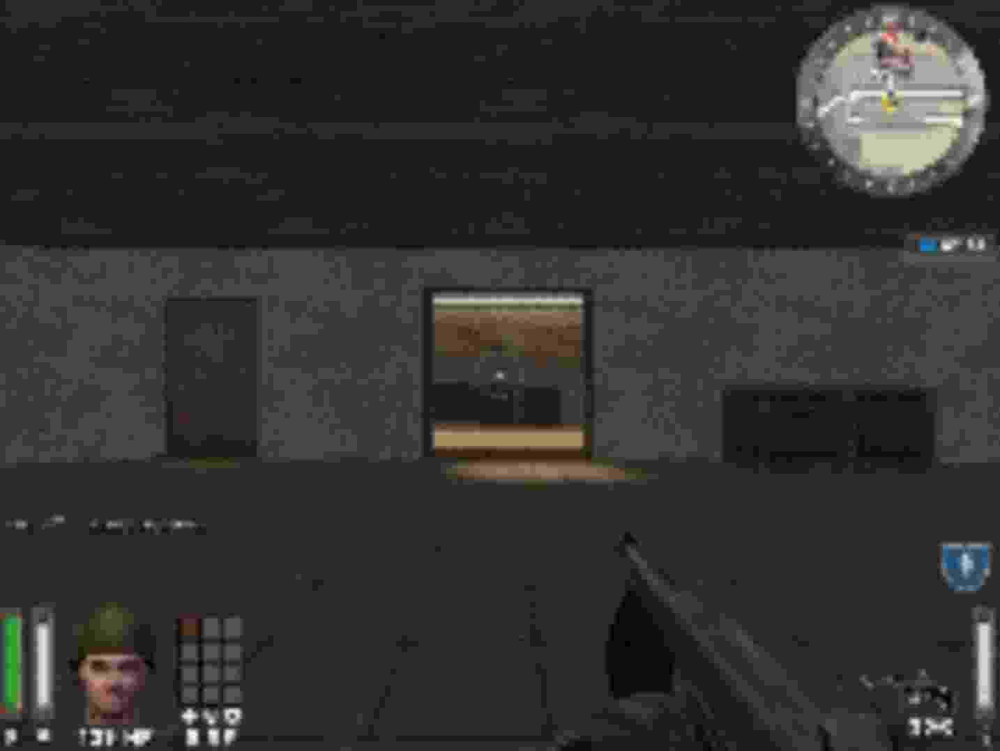
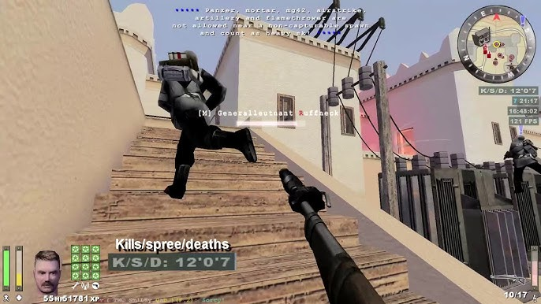

**Challenge Name:** You are my Special 0  
**Category:** Special  
**CTF:** CyberSummit V4.0 CTF  
**Description:**
Yuji swapped Inumaki's onigiri. Big mistake. Inumaki just stared, then pulled down his collar and rasped three commands: "YouTube. Old game. Search." Then he zipped his collar back up and walked away. No explanation. No hints. Just a mission. Yuji spent hours scrolling—past midnight, past 3 AM, past the point of sanity. Thumbnails blurred. Titles made no sense. He chased dead ends, clicked grainy uploads, and fought the YouTube algorithm like it was a cursed spirit. Just before dawn, he found it. He sent the link with trembling hands. A second later, his door slid open. Inumaki stood there, holding a fresh tuna mayo onigiri. He looked at Yuji's exhausted face, gave a small nod, and whispered: "...Salmon." Yuji took the onigiri. "Worth it," he yawned.

Can you retrieve the name of the old game?

> Flag Format: CyberTrace{gameFirstName_gameLastName}

---

## The Challenge

We've got a pixelated game image and need to figure out what old game it is. That's it. The flag format is `CyberTrace{gameFirstName_gameLastName}`.

---

## Solving It

### First Look: What Are We Looking At?

You open the image and... it's super pixelated. Classic retro vibes, but honestly hard to make out at first. The art style screams early 2000s gaming, definitely a shooter of some kind based on the character models and military aesthetic.



### Zooming In

After staring at it for a bit and zooming in, a few things become clear:

- Definitely military/soldier-themed
- Character models with that early 2000s FPS look
- The whole vibe is unmistakably Wolfenstein franchise

### The "Aha!" Moment

Search for "Wolfenstein games" and you'll quickly land on **Wolfenstein Enemy Territory** from 2003. That's it. That's the game. Everything clicks when you see it - the character models, the UI, the art style. Classic multiplayer FPS that was free-to-play.



### Getting the Flag

The format wants it as `CyberTrace{gameFirstName_gameLastName}`, so:

```text
CyberTrace{wolfenstein_enemyTerritory}
```

Done. Flag captured.
