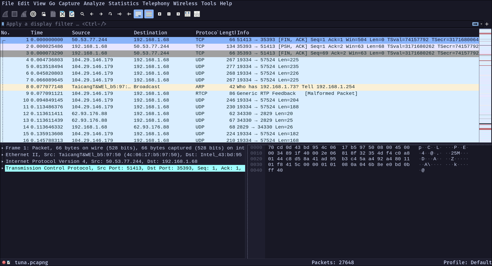
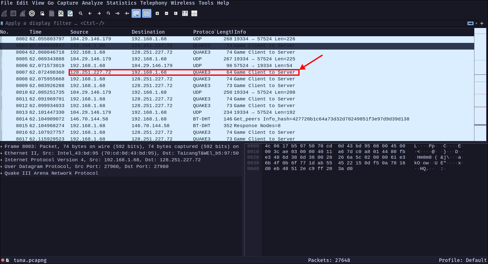
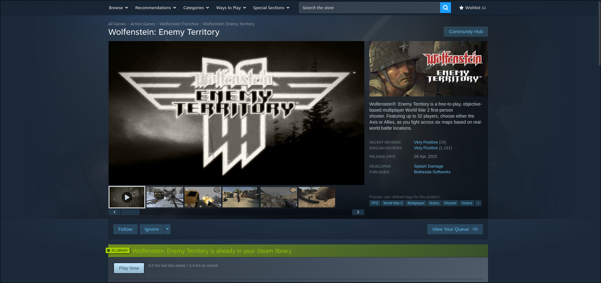
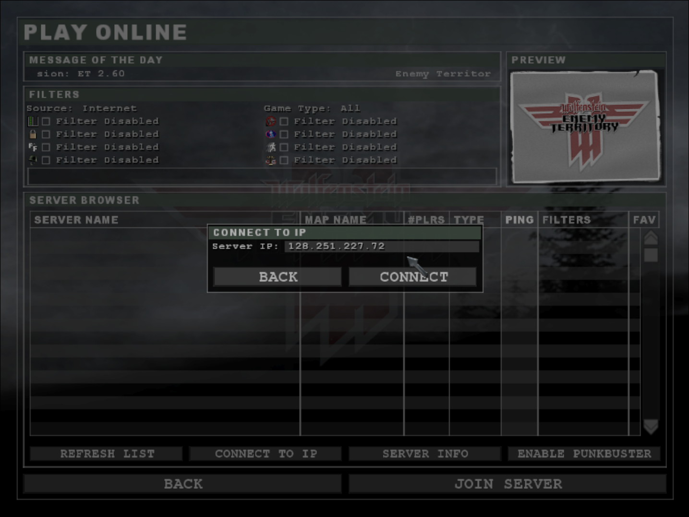
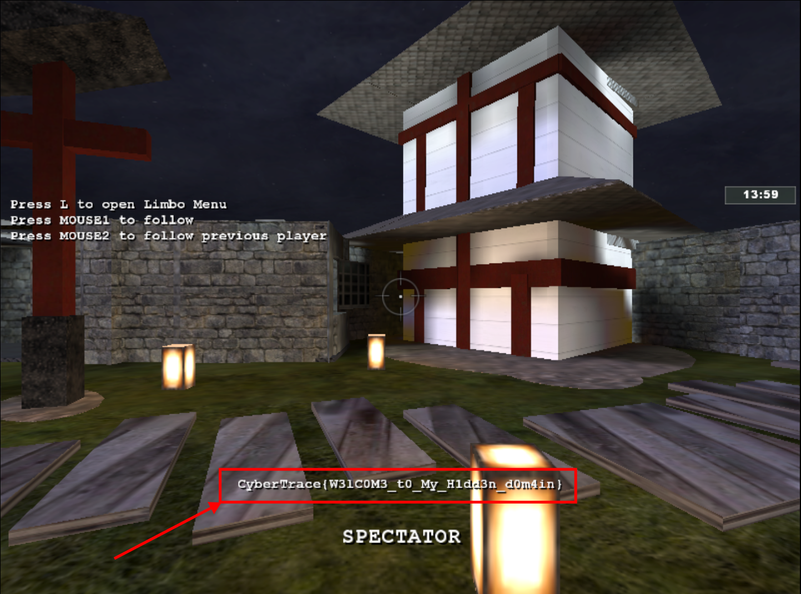

**Challenge Name:** You are my Special 1  
**Category:** Special
**CTF:** CyberSummit V4.0 CTF  
**Description:** Yuji ate the onigiri, eyes narrowing. Not over yet. He focused his cursed energy. "Secret Technique: Sniff Local Network." Energy rippled through the dorm Wi-Fi, locking onto Inumaki's device. Yuji saw activity but was truly astonished as he saw something quite peculiar. Whatever Inumaki was looking up… it was definitely for round two.  

---

## Initial Recon

We're handed a PCAP file: `tuna.pcapng`. No context, no hints—just a file and a vague description referencing the previous challenge. Time to fire up Wireshark and see what we're dealing with.



---

## The Protocol Discovery

After loading the PCAP, I start filtering and analyzing the traffic. The packets are interesting—not your typical web traffic or standard protocols. After some inspection, I notice something peculiar: **Quake3 protocol**.

This is uncommon. Why would a CTF challenge include a game protocol? And more importantly, the traffic is all directed to a specific IP: `128.251.227.72`.



At this point, I'm thinking: *What game uses Quake3? What's the connection?*

---

## Connecting the Dots

Then it clicks. The previous challenge was [**You are my Special 0**](). What game did we identify there? **Wolfenstein Enemy Territory**—a classic game that uses Quake3 as its underlying network protocol.

So we have:

- A PCAP showing Quake3 traffic
- Traffic directed to `128.251.227.72`
- Knowledge that this relates to Wolfenstein Enemy Territory

The challenge is becoming clearer: someone connected to a Wolfenstein ET server, and we need to figure out what they found (or what we can find) on that server.

---

## The Unconventional Move

Most CTF challenges involve reversing, exploiting, or analyzing. This one? This one wanted us to think differently.

If the server is still running at `128.251.227.72`, why not actually *connect* to it? Download Wolfenstein Enemy Territory and try connecting to that server ourselves.



---

## The Breakthrough

After installing the game and connecting to `128.251.227.72`:



 I launch into a map. And there it is—the moment you load in, the flag appears on your screen.



Sometimes the simplest solution is right in front of you.

```text
CyberTrace{W3lC0M3_t0_My_H1dd3n_d0m4in}
```

---

## Tools Used

- **Wireshark** - Network packet analysis and protocol identification
- **Wolfenstein Enemy Territory** - The game client (free and open-source)

---

## Takeaway

This challenge teaches an important lesson: **context is everything**. The connection to the previous challenge wasn't just flavor—it was the key to solving this one. And sometimes, the most "hacker-like" thing you can do is think creatively about how systems actually work in the real world.
