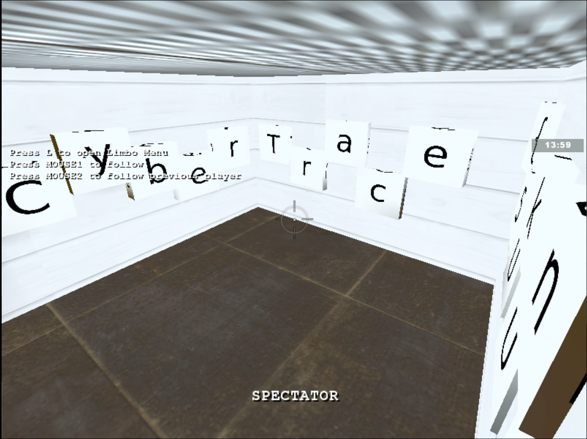
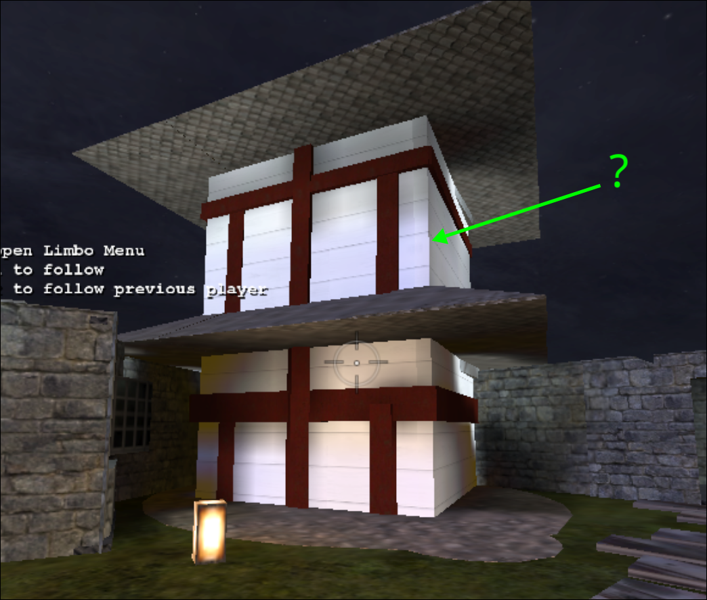
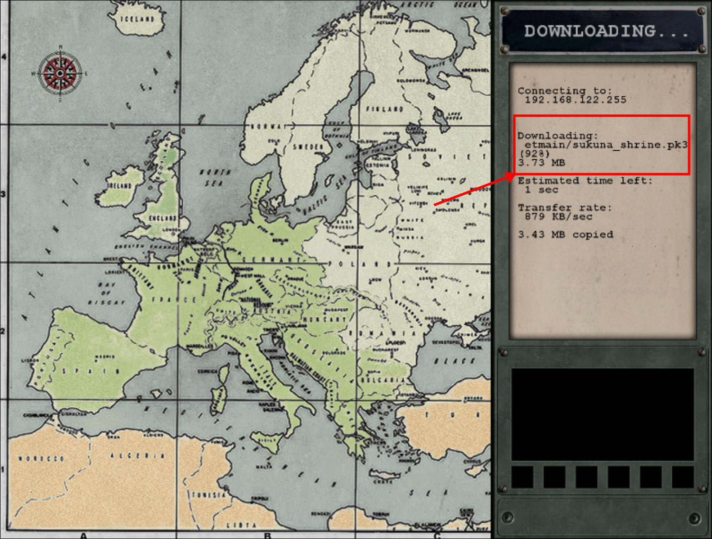
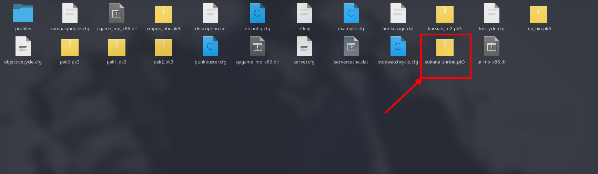
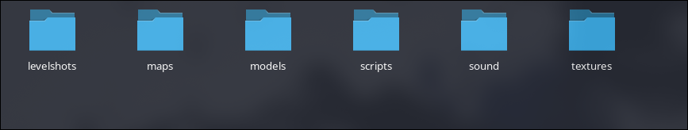
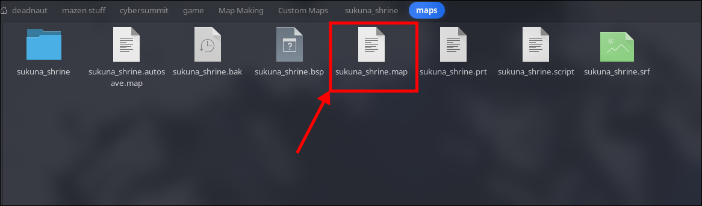
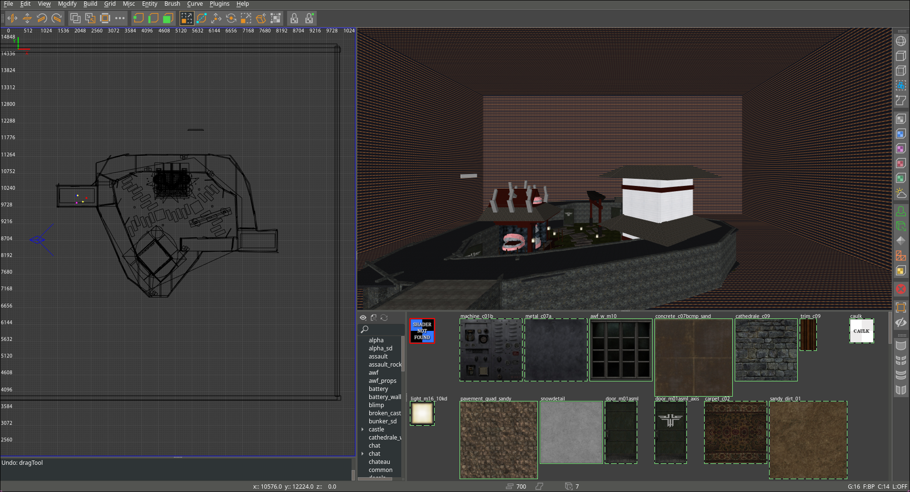
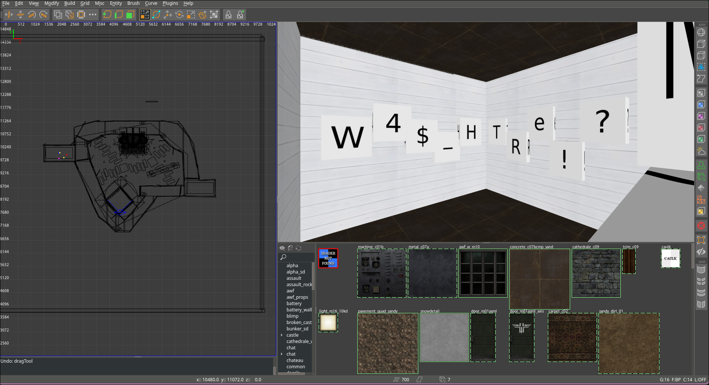

**Challenge Name:** You are my Special 2  
**Category:** Special
**CTF:** CyberSummit V4.0 CTF  
**Description:**
Yuji caught the trail—a weird server ping, a flicker of encrypted data—then his vision blurred. Too tired. He face-planted into his desk and was out cold before the laptop fan stopped spinning.

Next door, Inumaki wasn't sleepy at all. He'd loaded into an old game, drifting past totally zones until he found a place someone had mapped for years but never crossed. Inumaki adjusted his grip on the controller. His eyes stayed locked on the screen. He didn't need words for this. Just quiet, relentless curiosity.

---

## The Hunt Continues

After solving [**You are my Special 1**](), we thought we had it all figured out. We could navigate the WET server, find hidden spots... but this challenge had other plans. The flag was literally split in two, and half of it was locked away behind an invisible wall.

---

## Scouting the Map

We dropped into the map and immediately found the first half in a hidden room.  



The first part reads: `Cybertrace{5UkUn4_`

But then we hit the wall: the second half was clearly visible (or was it?) on an upper floor with no legitimate way to reach it.



---

## The Realization

At this point, we had two paths:

1. Fire up CheatEngine and start messing with memory offsets
2. Go deeper and think like a level designer, not just a player

We chose the second one.

---

## Following the Breadcrumbs

Here's where it gets interesting. When you connect to a custom WET server, the map gets downloaded to your local game directory. We realized this wasn't just texture streaming—the *entire* map was sitting there on disk.



The file was `sukuna_shrine.pk3`—and yeah, that's basically a zip file in disguise.



---

## Inside the Archive

We extracted the PK3 and started digging through the folder structure. Lots of texture assets, some config files, and then... a `.map` file. This is the source format before it gets compiled into the playable format the game uses.





A map file is essentially a blueprint. Everything is there—all coordinates, all entity placements, all visibility data. We had the master key.

---

## The Map Editor

This is where we pivoted from player to developer. After a lot of searching, we grabbed **NetRadiant**, the industry-standard map editor for `Wolfenstein: Enemy Territory`, and loaded up our extracted map file.



Now the magic happens. The editor shows you the full level with complete freedom of movement. No collision detection restrictions, no "you can't go here" barriers. We could fly around and see everything the designers ever placed.

---

## Reaching the Unreachable

Using NetRadiant's camera controls, we navigated to that forbidden upper floor. It was right there—fully detailed, completely accessible once you're in the editor.



And there it was: `W4$_H3Re!?_A84iN}`

---

## Victory

Combining both halves gives us the complete flag:

```
Cybertrace{5UkUn4_W4$_H3Re!?_A84iN}
```

---

## The Lesson

The real vulnerability wasn't in the game—it was in understanding the *pipeline*. Game files are meant to be modular and editable. When you download map assets, you're downloading the source material. The challenge designer(`aka me`) left the door open; we just had to find the right tool to walk through it.

Tools used:

- **NetRadiant** - The map editor that made it all possible
- **File extraction utilities** - To crack open the PK3
- **Curiosity** - The most important tool
