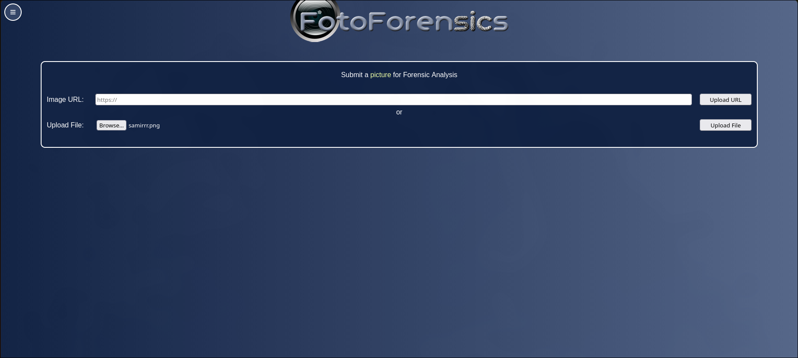

**Challenge Name:** Bad Boy  
**Category:** Forensics  
**CTF:** MOJO-JOJO  
**Description:** this cool cat wants to stretch ; help him

---

## Approach

### Initial Investigation

I started by examining the provided image file. The image appeared to be corrupted or incomplete, which aligns with the challenge hint about the cat wanting to "stretch."

### Traditional Forensics Tools

I first tried standard binary analysis approaches:

#### File Analysis

```
$ file samirrr.png
samirrr.png: PNG image data, 225 x 190, 8-bit/color RGB, non-interlaced
```

#### Binwalk Analysis

```
$ binwalk samirrr.png

DECIMAL       HEXADECIMAL      DESCRIPTION
0             0x0              PNG image, total size: 75281 bytes
```

Binwalk only identified the PNG header, no embedded files or suspicious signatures detected.

#### Strings Analysis

```
$ strings samirrr.png
IHDR
iCCPicc
cHRM
bKGD
zTXtRaw profile type icc
IDATx
...
```

The strings output only revealed standard PNG metadata and structure information - no readable text or flag data.

**Conclusion**: All three standard forensic tools returned irrelevant results, indicating the challenge required a more specialized approach.

### FotoForensics Analysis

Since traditional tools didn't yield results, I turned to a specialized image forensics tool: [FotoForensics](https://fotoforensics.com/) (an online tool for detecting image manipulation and hidden data).



The key breakthrough came when I:

1. Uploaded the image to FotoForensics
2. Used the **Hidden Pixels** feature
3. Discovered the full image of the cat with the flag embedded in the hidden pixel data


## Solution

The flag was revealed through the hidden pixel analysis on FotoForensics, which exposed data that was not visible in the standard image display.


## Flag

```
MOJO-JOJO{Samir_ykt4se77}
```

## Key Takeaway

When dealing with image challenges, especially those involving visual corruption or hidden data, specialized image forensics tools like FotoForensics can be more effective than general binary analysis tools. The "hidden pixels" feature specifically exploits how digital images can conceal data in ways that aren't immediately visible.
