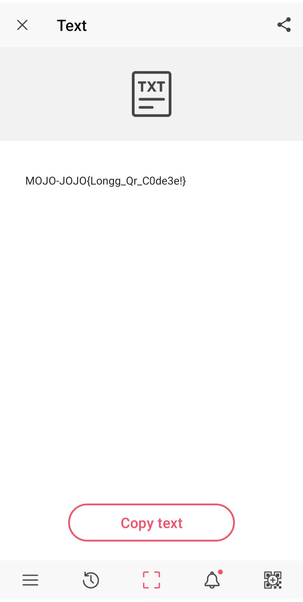

**Challenge Name:** Hmmm  
**Category:** Forensics  
**CTF:** MOJO-JOJO  
**Description:** found this image but i can't open it ; can u help meee

---

## Challenge Overview

We were given a file named secret.png.
The image could not be opened normally, and tools like binwalk showed no useful output.

At first glance, it looked like a corrupted PNG file.

## File Analysis

Running:

```
file secret.png
```

Returned:

```
secret.png: data
```

And:

```
exiftool secret.png
```

Returned a File format error.

This indicated that the file header was invalid and the image was not recognized as a proper PNG file.

## Hex Inspection

Using:

```
xxd secret.png | head
```

We observed that the PNG signature was incorrect.

A valid PNG header should start with:

```
89 50 4E 47 0D 0A 1A 0A
```

But the file began with slightly altered bytes.

Further inspection showed that the PNG structure (IHDR, IDAT, etc.) was still present, meaning only the header was corrupted.

## Repairing the PNG Header

We manually replaced the first 8 bytes with the correct PNG signature:

```bash
cp secret.png repaired.png
printf '\x89\x50\x4E\x47\x0D\x0A\x1A\x0A' | dd of=repaired.png bs=1 count=8 conv=notrunc
```

After that:

```
file repaired.png
```

Correctly identified it as:

```
PNG image data, 1030 x 110, 8-bit/color RGBA, non-interlaced
```

The image could now be opened successfully.


## QR Code Recovery

The repaired image contained a distorted QR code.

Attempts to decode it using:

```
zbarimg repaired.png
```

Failed.

The QR appeared partially damaged or misaligned, preventing common desktop tools from decoding it.

Instead of continuing manual reconstruction, we tried scanning the image using a mobile application called `QRQR` from the Play Store.

The mobile scanner successfully decoded the QR code and revealed the flag.



## Final Flag

```
MOJO-JOJO{Longg_Qr_C0de3e!}
```
