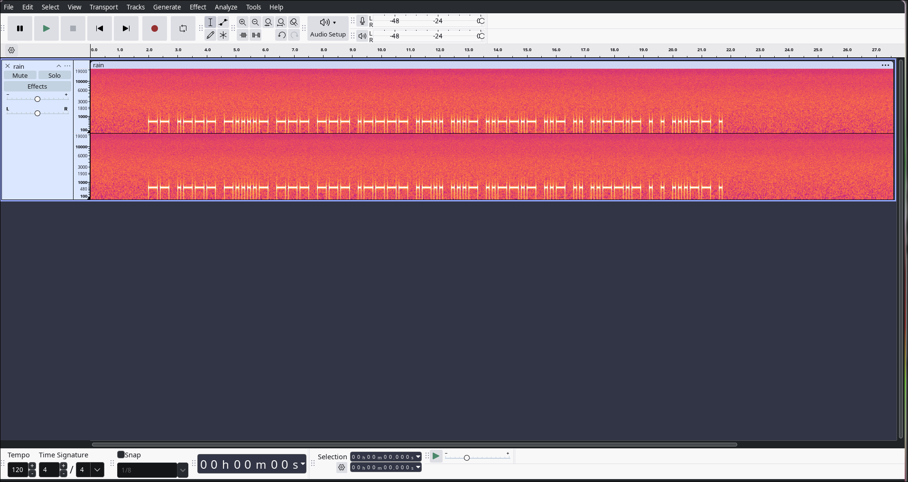
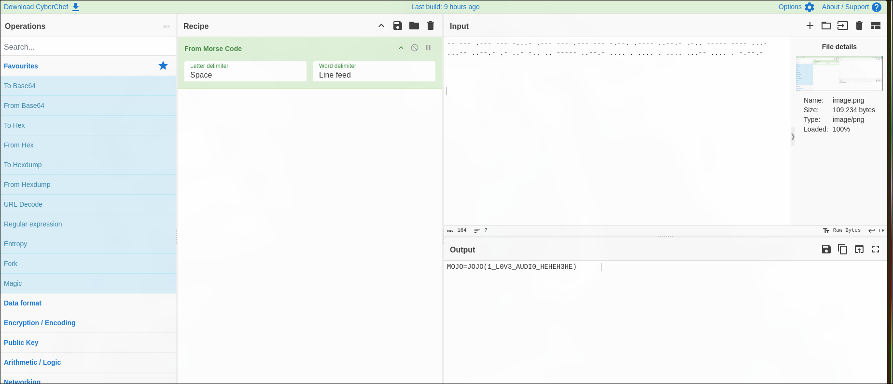

**Challenge Name:** Nature Symphony  
**Category:** Forensics  
**CTF:** MOJO-JOJO  
**Description:** While exploring an abandoned research facility, you discovered two audio recordings labeled rain.wav and fire.wav.The recordings seem ordinary at first - just sounds of nature. But something feels off...

---

## Overview

This challenge involves decoding Morse code from two audio files: `fire.wav` and `rain.wav`. Both files contain Morse audio signals that are not initially clear, but can be analyzed using audio editing software like Audacity.

## Audio Analysis

When the audio files are opened in Audacity and viewed in the spectrogram mode, the Morse characters become visible. The following Morse code sequences were extracted:

### Extracted Morse Code

- From `fire.wav`:

  ```
  -- .--- -...- --- --- .---- .-.. ...- ..--.- ..- .. ..--.- . . ...-- .
  ```


- From `rain.wav`:
  
  ```
  --- --- .--- .--- -.--. ..--.- ---- ...-- .- -.. ----- .... .... .... .... -.--.-
  ```



## Morse Code Conversion

Converting the extracted Morse code to characters yields:

- From `fire.wav`:  
  `MJ=OO1LV_UI_EE3E`


- From `rain.wav`:  
  `OOJJ(_3AD0HHHH)`


## Flag Format

The known flag format begins with:

```
MOJO-JOJO{
```

To construct the final flag, we alternate each letter from the decoded messages:

- **Alternating Letters**:
  - `MOJO=JOJO(1_L0V3_AUDI0_HEHEH3HE)`



## Final Flag

This results in the final flag:

```
MOJO-JOJO{1_L0V3_AUDI0_HEHEH3HE}
```
