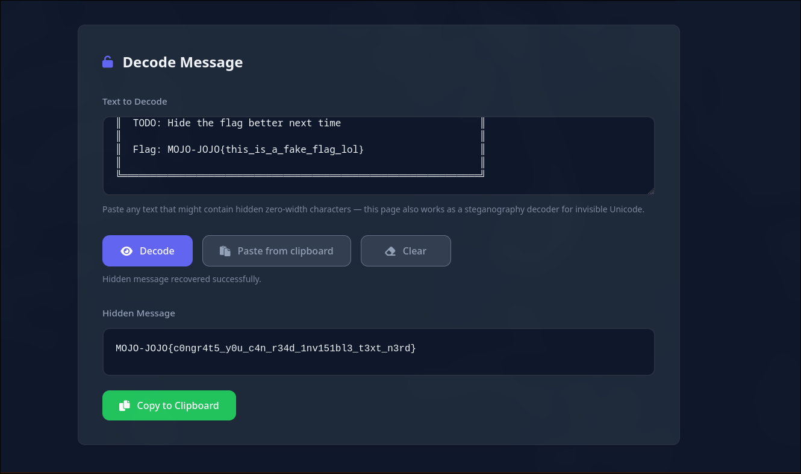

**Challenge Name:** Nightmare  
**Category:** Misc  
**CTF:** MOJO-JOJO  
**Description:** DO U KNOW WHAT IS SPECIAL ABOUT A NIGHTMARE??ME NEITHER LOL!!

---

## Problem Description

The challenge presents what appears to be innocent grocery notes in an ASCII art box. However, the actual flag is cleverly hidden using **zero-width characters** - invisible unicode characters that take up no visual space but exist in the text.


## Solution Approach

### Step 1: Recognizing the Attack Vector

The hint in the challenge title "Nightmare" combined with a file containing seemingly normal text suggests hidden data. Zero-width character encoding is a steganography technique that embeds information using:

- **Zero-Width Space** (U+200B)
- **Zero-Width Non-Joiner** (U+200C)
- **Zero-Width Joiner** (U+200D)
- **Zero-Width No-Break Space** (U+FEFF)

These characters are invisible to the human eye but can be detected programmatically.

### Step 2: Extracting the Hidden Message

To decode zero-width encrypted text, we need to:

1. Copy the suspicious text from the file
2. Use a tool or script to extract the zero-width characters
3. Convert the binary representation into readable text

### Step 3: Decoding the Binary

Zero-width characters are typically mapped as follows:

- **Zero-Width Space (U+200B)** = `0`
- **Zero-Width Joiner (U+200D)** = `1`
- Other variations may encode different binary patterns

The sequence of these invisible characters forms a binary string that can be decoded into ASCII text containing the flag.

## Key Techniques

### Detection Methods

1. **Hexdump/Binary analysis:** `hexdump -C` reveals hidden unicode characters
2. **Python script:** Extract and decode zero-width characters
3. **Online tools:** Zero-width character decoders available online

---

- In our case we choosed to use an online **Zero-width decoder** which is [stegzero](https://stegzero.com/):



## Final Flag

```
MOJO-JOJO{c0ngr4t5_y0u_c4n_r34d_1nv151bl3_t3xt_n3rd}
```
