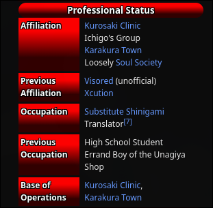
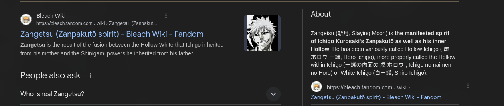

**Challenge Name:** Anime  
**Category:** Osint  
**CTF:** MOJO-JOJO  
**Description:** the author likes an anime very very much he wants u to find the anime name , his author , the main character full name , his job , his sword name and his main attack  
flag format :

```
MOJO-JOJO{AnimeName_MainCharacterFullName_Job_SwordName_MainAttack}
```

---

## Challenge Overview

The "Anime" challenge required us to identify an author's favorite anime and extract specific information about it. The flag format was:

```
MOJO-JOJO{AnimeName_MainCharacterFullName_Job_SwordName_MainAttack}
```

## Solution Steps

### Step 1: Identifying the Anime

**Clue:** The author's name was "Zanpakto"

The first breakthrough came from recognizing that "Zanpakto" is not a random name. A quick Google search revealed that a **Zanpakutō** (literally meaning "Soul-Cutting Sword") is the primary weapon wielded by Soul Reapers in the anime **Bleach**.

This was a strong indicator that **Bleach** was the target anime we needed to investigate.


---

### Step 2: Finding the Main Character

With Bleach identified as the anime, the next task was to find its protagonist.

A quick search for "Bleach anime protagonist" or "Bleach main character" immediately returned **Ichigo Kurosaki** as the answer.

Ichigo Kurosaki is the central character around which the entire series revolves.


---

### Step 3: Determining His Role/Job

To find the exact title of Ichigo's role, I consulted [Bleach fandom](https://bleach.fandom.com/wiki/Bleach_Wiki) — a comprehensive community-driven wiki dedicated to the Bleach series.

On the wiki, it was confirmed that Ichigo is a **Shinigami** (also known as a Soul Reaper), which are supernatural beings tasked with protecting the balance between the human world and the spirit world.



---

### Step 4: Identifying His Sword Name

Continuing the research on the Bleach wiki and through additional searches, I looked up the name of Ichigo's Zanpakutō.

His sword is called **Zangetsu** (meaning "Cutting Moon"), which is one of the most iconic weapons in the series.



---

### Step 5: Finding His Signature Attack

The final piece of the puzzle was discovering Ichigo's most famous and signature technique.

A search for "Ichigo's signature attack" or "Ichigo's main attack" revealed **Getsuga Tenshō** (meaning "Moon Fang Heaven-Piercer"), his most powerful and recognizable technique.


---

## Flag Construction

With all the required information collected:

| Information | Value |
|---|---|
| **Anime Name** | Bleach |
| **Main Character Full Name** | IchigoKurosaki |
| **Job/Role** | Shinigami |
| **Sword Name** | Zangetsu |
| **Main Attack** | GetsugaTenshō |

### Final Flag

```
MOJO-JOJO{Bleach_IchigoKurosaki_Shinigami_Zangetsu_GetsugaTenshō}
```
