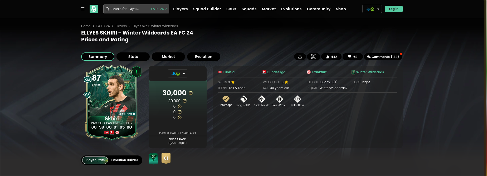

**Challenge Name:** FIFA / FC  
**Category:** Osint  
**CTF:** MOJO-JOJO  
**Description:** This task is for fun (not sure xD)

```
MOJO-JOJO{Name_Rating_Playstyle+_Team_NationalTeamNumber}
```

---

## Challenge Overview

The objective was to gather specific information from a FIFA player card to construct the flag. Required details:

- `Player Name`
- `Rating`
- `PlayStyle+`
- `Team`
- `National Team Number`

## Solution Process

### Step 1: Initial Card Analysis

The provided card was a special green card with the following characteristics:

- **Shooting**: 99
- **League**: Bundesliga
- **Position**: CDM (Central Defensive Midfielder)


### Step 2: Card Type Identification

The first critical step was identifying the card's promo type. To accomplish this, I visited [Futbin](https://www.futbin.com/), a comprehensive FIFA/FC card database with extensive filtering capabilities.

I systematically browsed through different special card designs across recent titles, starting from FC 26 and working backwards. After comparing multiple card styles, I identified the matching design in **FC 24** as the **Winter Wildcards** promo.

### Step 3: Filtering and Search

With the card promo identified, I used Futbin's filtering system:

- **Promo**: Winter Wildcards
- **League**: Bundesliga
- **Position**: CDM

This filtering dramatically narrowed the search results to just two cards.


### Step 4: Player Confirmation

A quick comparison between the two remaining cards revealed that **Ellyes Skhiri** was the only player with 99 Shooting, confirming the card's identity.



### Step 5: Gathering Required Information

With the player and promo confirmed, I collected the remaining required details through Futbin and verification searches:

| Detail | Value |
|--------|-------|
| Player Name | Skhiri |
| Rating | 87 |
| PlayStyle+ | Intercept+ |
| Team | Frankfurt |
| National Team Number | 17 |

## Flag Construction

Using the gathered information, the flag was constructed as follows:

```
MOJO-JOJO{Skhiri_87_Intercept+_Frankfurt_17}
```
