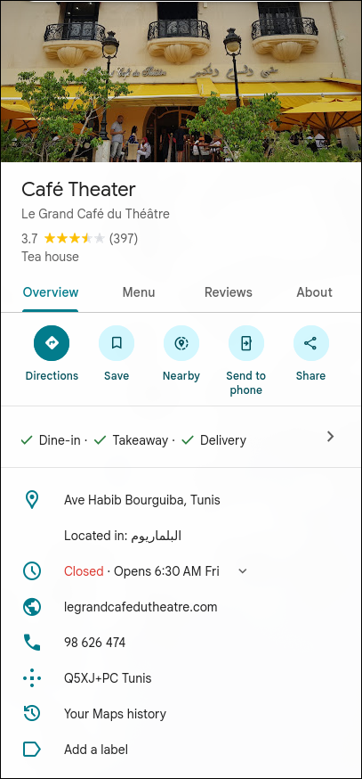

**Challenge Name:** Serial Killer 1  
**Category:** Osint  
**CTF:** MOJO-JOJO  
**Description:** Your only starting evidence: a photo recovered from a victim’s phone in **Kairouan**.

Flag Format :MOJO-JOJO{City_NN} NN: First and Second of digits the phone Number

---

## Solution

### Initial Analysis

The handout was a pixelated PNG image, suggesting that the information inside was intentionally obscured or encrypted in some way. The pixelation indicated that steganography or image encryption was likely used to hide the flag.

### Step 1: Identifying the Decryption Method

Since the image appeared to be encrypted rather than just visually obscured, I decided to use an image decryption tool. I navigated to [Image Online Encrypt/Decrypt](https://encrypt.imageonline.co/) to attempt decrypting the image.


### Step 2: Finding the Decryption Key

The decryption tool required a key. Returning to the challenge description, I noticed that only one word was highlighted in bold: **Kairouan**. This was clearly the hint for the decryption key.

**Key used:** `Kairouan`


### Step 3: Decrypting the Image

After entering "Kairouan" as the key in the Image Online Encrypt/Decrypt tool, the hidden image was successfully revealed.


### Step 4: Analyzing the Revealed Information

The decrypted image showed:

- A number displayed prominently: **71**
- An image of a cafe located in **Tunis**



The challenge required finding both the city and a two-digit magic number. Based on the decrypted image:

- **City:** Tunis
- **Magic Number:** 71

### Flag

Combining the location and the two-digit number according to the specified format:

```
MOJO-JOJO{Tunis_71}
```
