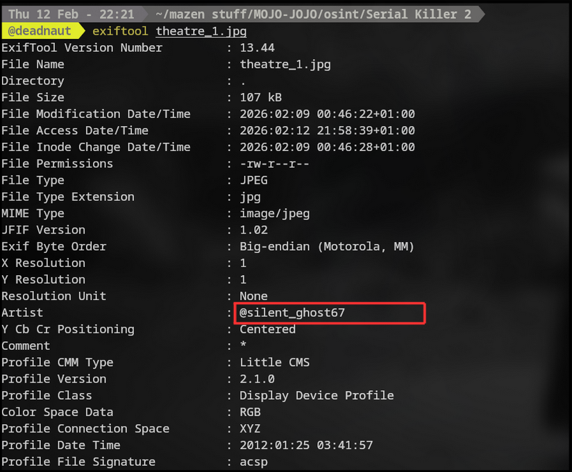

**Challenge Name:** Serial Killer 2  
**Category:** Osint  
**CTF:** MOJO-JOJO  
**Description:** The café shown in the photo still exists.  
But records confirm the killer was never physically present there.  
He was watching… from somewhere else.  
Study the image carefully and track the vantage point. Think like an investigator. Every detail matters.  
Flag Format : MOJO-JOJO{City_Name_NN}

---

## Introduction

In this challenge, I encountered an image that seemed familiar. Upon closer inspection, it turned out to be the same image I decrypted in a previous challenge, which raised my suspicions and prompted further investigation.

## Step 1: Analyzing the Image Metadata

After opening the handout image, I decided to examine the file’s metadata using **ExifTool**. Hiding data in image metadata is a classic CTF technique, often placed in fields like **Artist**. This led to the discovery of a username that would be crucial for the next steps.

  

## Step 2: Username Investigation

With the newly discovered username, I turned to [whatsmyname](https://whatsmyname.me/), a tool that helps identify platforms associated with a specific username.


 This search revealed an **X account** where the user had posted only one picture, captioned “Nothing is where it should be.”

  

## Step 3: Location Clue

Investigating the post, I found that the photo was taken in **Bizerte**, specifically at the **Bridge of Bizerte**. However, this seemed like a rabbit hole, so instead of chasing it, I decided to examine the accounts the user was following for further clues.


## Step 4: Following the Leads

One of the accounts the user followed, **Jeffry Millard**, looked suspicious. I decided to investigate it more closely. The postal code in Jeffry Millard’s profile pointed to **El Hamma** in **Gabes**, giving us the city.

  

## Step 5: Finding the Flag

We still needed the two-digit number. After some thinking, I remembered that the first X account had “67” in its username. Given the recent trend of using 67, I tried it — and that gave us the flag.

## Final Flag

The final flag for this challenge is:

```
MOJO-JOJO{El_Hamma_67}
```
