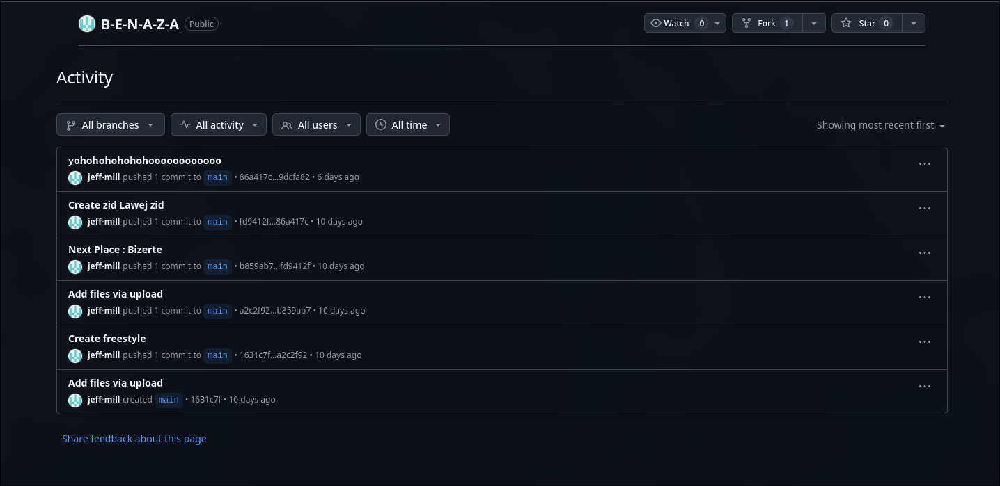

**Challenge Name:** Serial Killer 3  
**Category:** Osint  
**CTF:** MOJO-JOJO  
**Description:** Good work. The account you uncovered belongs to a graphic designer involved in several projects.  
Strangely, none of these projects seem easy to trace. Almost as if they were meant to disappear.  
Where did these works surface? And what do they reveal?  
Keep digging.  
Flag Format: MOJO-JOJO{City_NN}

---

## Challenge Description

> "None of these projects seem easy to trace. Almost as if they were meant to disappear."

The challenge hints at deleted or hidden content that needs to be uncovered through OSINT techniques.

## Solution

### Step 1: Finding Deleted Posts

Reading the description carefully, it was clear that the posts had been deleted. To recover deleted web content, I turned to [archive.ph](https://archive.ph/) to search for archived snapshots of the target page.


### Step 2: Discovering the GitHub Repository

Success! The archived snapshot revealed a deleted post that contained a link to a **GitHub repository**.


### Step 3: Decoding the Base64 String

Diving into the repository, I found a `.txt` file containing a **Base64-encoded string**.


Using [CyberChef](https://gchq.github.io/CyberChef/), I decoded the string and retrieved the missing **two-digit number: 22**.


### Step 4: Finding the City

We still needed to identify the city. I explored the repository further and checked the **commit history**.



In one of the commits, the city was finally revealed: **Bizerte**.


## Flag

```
MOJO-JOJO{Bizerte_22}
```

