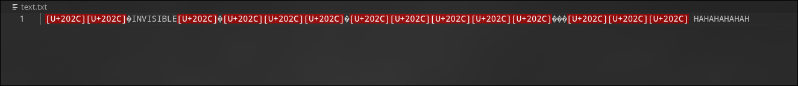
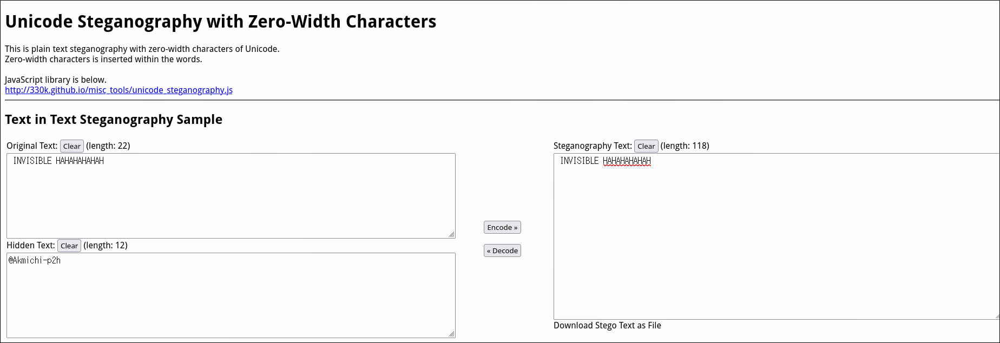
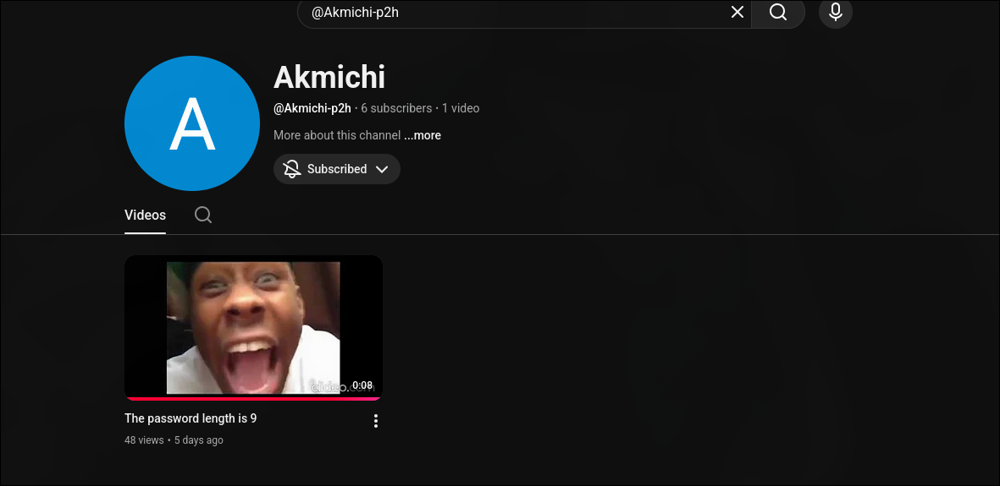
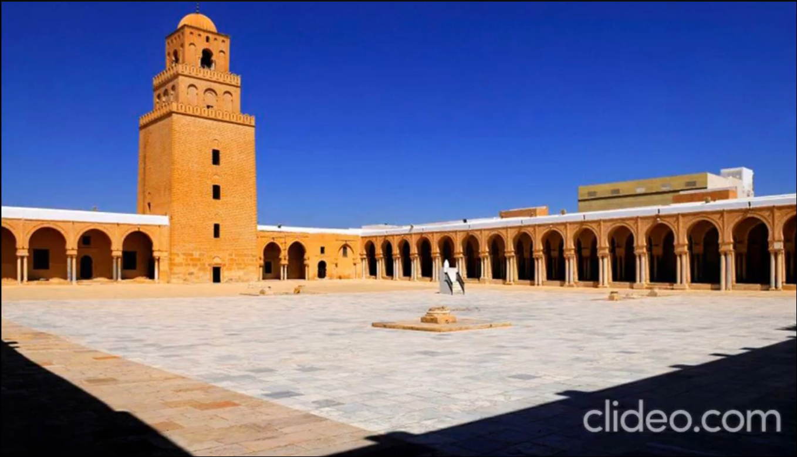

**Challenge Name:** Serial Killer 4  
**Category:** Osint  
**CTF:** MOJO-JOJO  
**Description:** Tracking the killer led investigators to another possible location.  
A full search yielded almost nothing — except two mysterious files.  
Somewhere inside them lies the next clue.  
Your move.

---

## Solution

### Step 1: Analyzing the Text File - Zero-Width Steganography

Opening the `.txt` handout, the content appeared corrupted at first glance, which was immediately suspicious.



This behavior is characteristic of **zero-width characters** being used for steganography. To extract the hidden data, we used the **Unicode Steganography Decoder**.



**Result:** We successfully extracted a hidden username from the zero-width characters.


---

### Step 2: Decoding the Audio File - Morse Code

Next, we examined the `.wav` handout. Upon listening, it was clearly **Morse code**.

We used a **Morse Code Audio Decoder** to translate the audio signal:


**Decoded Message:**

```
I HAVE ONLY 03 SUBSCRIBERS ON MY CHANNEL BROO
```

This revealed two critical pieces of information:

1. The user runs a **YouTube channel**
2. The channel had **3 subscribers** (suggesting the two-digit number is `03`)

---

### Step 3: Finding the YouTube Channel

Using the username extracted from Step 1, we searched for the corresponding YouTube channel.


At the time of the CTF, the channel indeed had **3 subscribers**, confirming our findings from the Morse code.



---

### Step 4: Geolocation via Image OSINT

We proceeded to examine the video content on the channel for the next clue.



The video contained an image of a mosque. To geolocate it, we performed **image-based OSINT** using **Yandex AI Images** (also known as Yandex Image Search), which is particularly powerful for reverse image searching.


**Result:** The mosque was identified as the **Oqba Bin Nafi Mosque** (also known as the Great Mosque of Kairouan) located in **Kairouan, Tunisia**.


---

## Flag Construction

With all the pieces gathered:

- **Location:** Kairouan (from the mosque geolocation)
- **Number:** 03 (from the Morse code message about subscribers)

### Final Flag

```
MOJO-JOJO{Kairouan_03}
```

