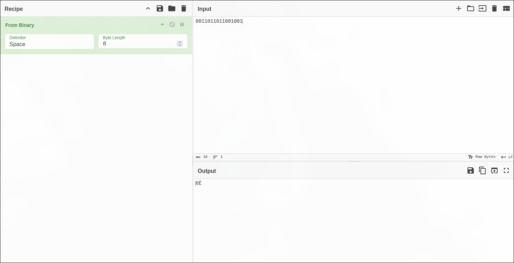
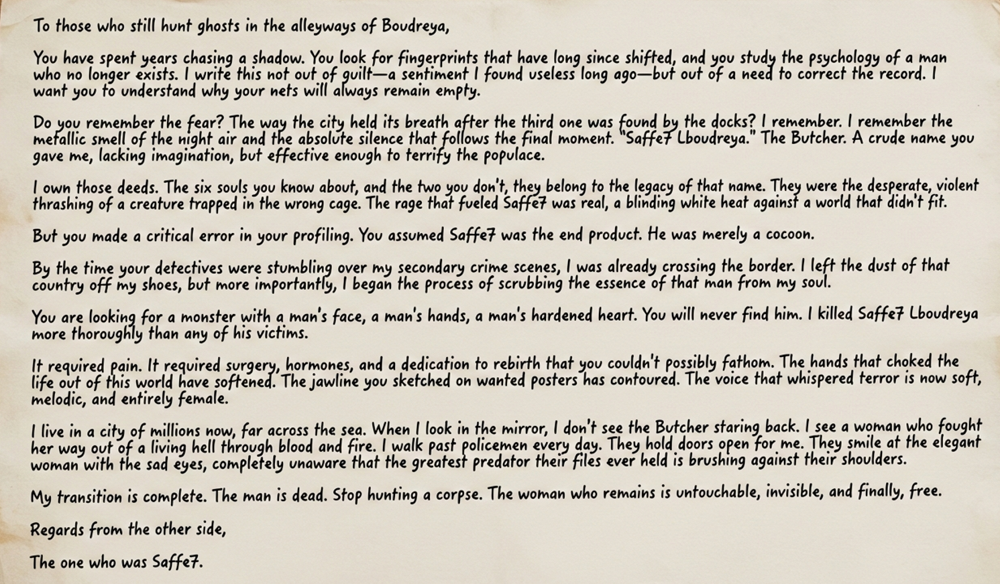

**Challenge Name:** Serial Killer 5  
**Category:** Osint  
**CTF:** MOJO-JOJO  
**Description:** What…? This can’t be right.  
All trails lead back to where everything started — the first location, the first clue.  
By retracing the suspect’s movements and searching every possible lead, investigators finally uncovered one last piece of evidence:  
An encrypted ZIP archive, with nothing but a weird chessboard position, seemingly arranged without logic or rules.  
But this board is no random game — it leads the final message.  
Decrypt the archive. Analyze the board. Only then will you be able to uncover the real identity of the killer.  
Flag Format: MOJO-JOJO{Killer_Identity}

---

## Solution

### Step 1: Identify the Password Length

Returning to [Serial Killer 4](), The YouTube video titled **"the password length is 9"** provided the critical first clue — the ZIP archive was password-protected with a 9-character password.


### Step 2: Decode the Image Handout

Using [CyberChef](https://gchq.github.io/CyberChef/), we decoded the image handout by interpreting it as binary data where:

- `0` = White pixel
- `1` = Black pixel

This binary-to-image conversion revealed the digit: **6**




### Step 3: Combine Previous Flags

From earlier stages of the investigation, we had collected 4 flags containing 8 digits in total. Combining these with the newly decoded digit (6), we constructed the complete 9-character password:

```
716722036
```

| Source | Contribution |
|--------|-------------|
| Serial Killer 1 | 71 |
| Serial Killer 2 | 67 |
| Serial Killer 3 | 22 |
| Serial Killer 4 | 03 |
| Binary Decode | 6 |
| **Total** | **716722036** |

### Step 4: Extract the ZIP Archive

Using the password `716722036`, we extracted the contents of the encrypted ZIP archive.

```bash
unzip -P 716722036 handout.zip
```


### Step 5: Analyze the Extracted Picture

The ZIP archive contained a picture file. Upon examination of the image, it revealed the hidden message containing the killer's identity.



## Final Flag

Reading the decrypted image yielded the final flag:

```
MOJO-JOJO{Saffe7_Lboudreya}
```

